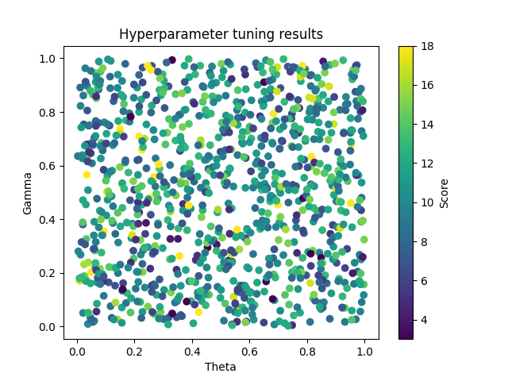

# The Dice Game

AI written in Python that can play a simple dice game. 

## Game rules:

The player starts with 0 points
Roll three fair six-sided dice

Now choose one of the following:
* Stick, accept the values shown. If two or more dice show the same values, then all of them are flipped upside down: 1 becomes 6, 2 becomes 5, 3 becomes 4, and vice versa. The total is then added to your points and this is your final score.
* OR reroll the dice. You may choose to hold any combination of the dice on the current value shown. Rerolling costs you 1 point – so during the game and perhaps even at the end your score may be negative. You then make this same choice again.

The best possible score for this game is 18 and is achieved by rolling three 1s on the first roll.
The reroll penalty prevents you from rolling forever to get this score. If the value of the current dice is greater 
than the expected value of rerolling them (accounting for the penalty), then you should stick.

## Installation

1. Install Poetry by running `pip install poetry` in your command line.
2. Clone this repository by running `git clone https://github.com/leoneperdigao/dicegame.git` in your command line.
3. Navigate to the root directory of the cloned repository by running `cd dicegame`.
4. Use Poetry to install the dependencies by running poetry install. This will create a virtual environment for the project and install all the required packages.
5. Run the game by executing `poetry run python dice_game.py`.
6. Enjoy the game!

## Methodoly

Value iteration and policy iteration are two popular algorithms for solving Markov Decision Processes (MDPs). 
Both algorithms are used to find an optimal policy for an agent to follow in a given MDP.

Value iteration is an iterative algorithm that starts with an initial value function and repeatedly updates the value 
function until it converges to the optimal value function. The algorithm consists of the following steps:

1. Initialize the value function for all states.
2. Iterate over all states and update the value function using the Bellman equation.
3. Check the maximum change in the value function, if it is below a certain threshold (theta), then stop, otherwise go back to step 2.

The optimal policy can be found by taking the action that maximizes the expected value of the next state at each step.

Policy iteration is another algorithm that solves MDPs. The algorithm consists of the following steps:

1. Initialize a random policy for all states.
2. Evaluate the current policy by computing the value function for all states.
3. Improve the policy by finding the action that maximizes the expected value of the next state for each state.
4. Check if the policy has changed, if it has not, then stop, otherwise go back to step 2.

In this specific case, the algorithm is implemented to find the optimal policy for playing a dice game. 
The agent starts at a given state and repeatedly takes actions based on the current policy. 
The agent's goal is to find the policy that maximizes the expected reward over the long run.

The main difference between the two algorithms is that value iteration directly computes the optimal value function and 
then extracts the optimal policy, while policy iteration alternates between evaluating the current policy and improving the policy.

The time complexity of value iteration is O(n^2) where n is the number of states. The space complexity is O(n) because we only need to store the value function for each state.

The time complexity of policy iteration is O(n^2 * k) where n is the number of states and k is the number of iterations until convergence. 
The space complexity is O(n), because we only need to store the policy for each state.

In terms of pros and cons, value iteration is more efficient in terms of time complexity, but it may require more iterations to converge. 
Policy iteration is more efficient in terms of the number of iterations, but it has a higher time complexity.

It is important to note that the choice of algorithm depends on the specific problem and the trade-offs that need to be made. 
For example, if the problem is large and memory is a concern, value iteration is a better choice because it requires less memory. 
However, if the problem is small and fast convergence is required, policy iteration is a better choice.

### Code overview

The solution is created in the package `agent` that holds a module `dice_game_agent.py` which defines a class called 
MyAgent which subclasses DiceGameAgent. The class has an init method that takes in the game object and two optional 
parameters, gamma and theta.

The init method initializes the class with the game object passed in, and sets the class attributes __gamma and
__theta to the values passed in or defaults if none were passed. Also, it creates a dictionary __policy and __v_arr 
to store the policies and value of states, and the __local_cache attribute is a dictionary used to cache results of 
the get_next_states_cached method.

The __init_policy method initializes the __policy dictionary by setting all actions to a random action. 
The __policy_iteration method performs the Policy Iteration algorithm to find the optimal policy for the agent by 
calling the __policy_evaluation and __policy_improvement methods.

__policy_evaluation method takes in a policy and v_arr as input and returns v_arr after updating the utility values of 
the states using the current policy. It does this by iterating through all the states and updating the value of each 
state using the expected value of the reward obtained from taking the action in the current policy in that state. 
It continues this process until the maximum change in the value of any state is less than theta.

__policy_improvement method takes in the current policy, v_arr, and a state and returns the best action to take in 
that state. It does this by iterating through all the possible actions, calculating the expected value of the reward 
obtained from taking that action and selecting the action that results in the highest expected value.

The play method takes in a state as input and returns the action to take in that state based on the current policy.

The gamma parameter is the discount factor, which controls the importance of future rewards. 
A high value means future rewards are important, a low value means they are not. Theta is a stopping criterion. 
It is used to check whether the utility values of the states have converged to the optimal values or not.

## Results

Results of 1000 executions with random gamma and theta values:

```
+----------------------+-----------------------+---------------+----------------------------+
|        Theta         |         Gamma         |     Score     |     Execution Time (s)     |
+----------------------+-----------------------+---------------+----------------------------+
|  0.6066737070775166  |   0.7010561799284195  |       13      |   0.00023200000000000998   |
|  0.8434899410267308  |   0.6979724944721085  |       10      |    0.000256000000000034    |
|  0.8114229025057548  |  0.16170939201003584  |       17      |   0.00020499999999978868   |
|  0.7515608831579549  |   0.7249478328510701  |       9       |   0.00023399999999984544   |
|  0.8686848167078209  |   0.1606748769579263  |       8       |   0.0002780000000002225    |
|  0.6285168108304784  |   0.9012688687002757  |       12      |   0.00034100000000014674   |
|  0.1565756469376533  |   0.5288859650767193  |       18      |   0.00023300000000014975   |
|  0.3201025844051424  |  0.45060825143207617  |       10      |   0.00035600000000002296   |
|  0.320246674755636   |   0.7733588654913933  |       14      |   0.00020299999999995322   |
|  0.3933698227196732  |    0.50633788330655   |       7       |   0.00027600000000038705   |
|  0.750192195398363   |   0.5279517666881967  |       7       |   0.00018199999999968242   |
|  0.5175082636552789  |   0.526299799795102   |       8       |   0.00027099999999968816   |
|  0.8352773873328387  |   0.8194854333867366  |       13      |   0.0002670000000000172    |
| 0.41891162638357365  |  0.26401415884003593  |       5       |   0.00028200000000033754   |
|  0.5259915775619939  |   0.2367964008204521  |       12      |   0.0002620000000002065    |
| 0.18988892564680487  |   0.3291638865832101  |       11      |   0.00022999999999973042   |
|  0.502786597630829   |   0.2645801526293739  |       11      |   0.00017499999999959215   |
|  0.825347614244569   |   0.5225713338936928  |       11      |   0.00017300000000020077   |
|  0.5447879628569727  |  0.11024268937125947  |       17      |   0.0002790000000008064    |
| 0.46986587768860366  |   0.9697741633355587  |       10      |   0.0002250000000003638    |
| 0.13382416350975374  |  0.34508248536732433  |       8       |   0.00020500000000023277   |
| 0.10815839271764943  |   0.9960444969617359  |       11      |   0.0002409999999999357    |
| 0.05062303548864522  |  0.20289614676796575  |       18      |   0.00024900000000016576   |
|  0.6916595938795397  |   0.7654136902161058  |       15      |   0.0003260000000002705    |
| 0.48890999274512464  |   0.4254959467288575  |       12      |   0.0001930000000003318    |
| 0.12782266251292915  |   0.840302154048907   |       8       |   0.00019499999999972317   |
|  0.6500644848061873  |  0.014089344429111778 |       6       |   0.0002840000000006171    |
|  0.8141945542841537  |   0.5968583129951818  |       15      |   0.00020000000000042206   |
|  0.7071466747875611  |  0.05831088238017224  |       10      |   0.00022799999999989495   |
|  0.5277919670781137  |  0.24551512232884637  |       4       |   0.00047499999999978115   |
|  0.6731121326666396  |   0.8800857891804148  |       6       |   0.00018100000000043082   |
|  0.4483624132588556  |   0.7946337719133019  |       12      |   0.0004450000000000287    |
|  0.3164039652564884  |   0.3968600645337966  |       13      |   0.00017400000000034055   |
|  0.5704156856972347  |   0.1256216942606825  |       8       |    0.000268000000000157    |
|  0.6718309039980783  |  0.46646645090300726  |       13      |   0.0003759999999992658    |
|  0.968130381010587   |   0.8754096941260425  |       7       |   0.0002789999999999182    |
| 0.45739094677962666  |   0.5876441743118137  |       7       |   0.00023900000000054433   |
| 0.12535046566512587  |   0.6758204794946279  |       11      |   0.0004230000000005063    |
|  0.331350623065813   |   0.9936818164272916  |       3       |   0.00032300000000162754   |
|  0.544370981601632   |   0.5219056459795764  |       10      |   0.00029600000000051807   |
|  0.6243003245996397  |   0.6458775318407938  |       11      |   0.00023400000000073362   |
|  0.6989729122428101  |  0.45407251196926307  |       18      |    0.000268000000000157    |
|  0.1565996787734553  |  0.07007231377924093  |       12      |   0.00022899999999914655   |
|  0.3783500291138745  |   0.8086268642564473  |       13      |   0.00021700000000102193   |
|  0.941303760334945   |   0.5420187453213939  |       14      |   0.0002089999999999037    |
| 0.27278962351352043  |   0.2792920117621221  |       10      |   0.00023599999999923682   |
| 0.07979826119976043  |   0.4316281500014534  |       12      |   0.0001870000000003813    |
|  0.6827132062383651  |   0.2544702813660283  |       8       |   0.0002729999999999677    |
|  0.4387650208276783  |  0.25426477068133574  |       12      |   0.00019900000000028228   |
| 0.19306441883336692  |   0.3831408046676138  |       10      |   0.0002290000000009229    |
| 0.055672156251005814 |   0.6758685910925789  |       10      |   0.0002309999999994261    |
| 0.08193708968490623  |   0.9492962953064911  |       14      |    0.000268000000000157    |
|  0.2819475630285089  |  0.47638791903832417  |       11      |   0.0002689999999994086    |
|  0.9347458373692616  |    0.82751986422537   |       9       |   0.00023200000000045407   |
|  0.591570029676448   |  0.36335193354989526  |       9       |   0.0002020000000015898    |
|  0.4608823704703075  |   0.6318147230972956  |       10      |   0.00023900000000054433   |
| 0.15841447998281705  |  0.44210795820957927  |       13      |   0.00017299999999842441   |
| 0.06259022365656274  |   0.2830790007069588  |       14      |   0.00027599999999949887   |
|  0.8184189006297681  |   0.7708841337060856  |       10      |   0.0002469999999998862    |
|  0.4339608657940147  |  0.09485832698169996  |       12      |   0.00022399999999933584   |
|  0.4574455494928609  |   0.1818620856272208  |       10      |   0.0002589999999997872    |
| 0.20468691703829672  |  0.14070321807036626  |       9       |   0.0002300000000001745    |
| 0.19653491854456528  |   0.5419689465838581  |       15      |   0.0002300000000001745    |
|  0.9313933706240631  |   0.1631015837412397  |       9       |   0.0001879999999996329    |
|  0.887825393527411   |   0.525581463205969   |       10      |   0.00037200000000048306   |
|  0.8158063375840829  |   0.6332237942237092  |       18      |   0.00025499999999922807   |
|  0.3843847418854473  |   0.882080647962278   |       12      |   0.0002309999999994261    |
|  0.6249840512408794  |    0.38427571523259   |       10      |   0.00016800000000039006   |
|  0.6789022324267692  |   0.685927938511375   |       12      |   0.00022600000000139175   |
|  0.144004285722884   |   0.3127788925977239  |       10      |   0.00026000000000081513   |
|  0.3116776853158038  |   0.525203717503234   |       9       |   0.00025300000000072487   |
|  0.6279916234647966  |   0.6165349716883131  |       9       |   0.00022600000000139175   |
|  0.8930200547528875  |   0.7549974002055242  |       17      |   0.0002729999999999677    |
|  0.2225011608755249  |   0.2674748649308024  |       10      |   0.00023200000000045407   |
| 0.35337616148071344  |  0.36550900853574575  |       13      |   0.00020199999999981344   |
|  0.6428350964474159  |   0.562383082563124   |       10      |   0.00023499999999998522   |
|  0.9233410978672677  |  0.06927523289248555  |       10      |   0.00024400000000035504   |
| 0.23577512965960984  |   0.6998559365421531  |       16      |   0.0003650000000003928    |
|  0.9882840188210612  |  0.38989262850949596  |       14      |   0.0002760000000012752    |
|  0.2701236495966002  |   0.697673408864397   |       10      |   0.0002259999999996154    |
| 0.17963955424673758  |   0.5738950297983724  |       13      |   0.0002580000000005356    |
| 0.06163575666536917  |   0.7046935505415496  |       6       |   0.00023600000000101318   |
|  0.9566570735492759  |   0.3699427444580146  |       12      |   0.00022199999999905629   |
|  0.8935103696605703  |   0.4905088269717081  |       12      |   0.00034199999999984243   |
|  0.6830841575005282  |   0.4797911312089304  |       10      |    0.000344000000000122    |
|  0.8383399974069069  |   0.7263330580478201  |       12      |   0.00027199999999893976   |
|  0.8749027854855418  |   0.7535680306839789  |       10      |   0.00023600000000101318   |
| 0.35681749726680845  |  0.11261393181143066  |       12      |   0.0002429999999993271    |
|  0.8793489763497134  |  0.028250132586167136 |       8       |   0.00027500000000024727   |
|  0.7480932256303372  |  0.20221789786814137  |       13      |   0.0002089999999999037    |
| 0.35668521697919425  |  0.26272994088466106  |       18      |   0.00024999999999941735   |
|  0.8482106971649027  |   0.214685631385655   |       9       |   0.00023400000000073362   |
|  0.397056686399857   |  0.09472063824947603  |       13      |   0.00023800000000129273   |
| 0.11086977050634543  |   0.1642304678419311  |       7       |   0.00023600000000101318   |
| 0.02276968468505339  |   0.861351892799299   |       9       |   0.0002579999999987592    |
|  0.9392455969032689  |   0.2889936508560898  |       6       |   0.00026599999999987745   |
|  0.0514432222844262  |   0.6847084611831399  |       10      |   0.0002940000000002385    |
|  0.533469898689973   |   0.9770120999681419  |       12      |   0.0002589999999997872    |
|  0.8894915246678123  |   0.3780878838477675  |       6       |   0.00022200000000083264   |
|  0.9497662856182101  |   0.6035402816571604  |       9       |   0.00024099999999904753   |
|  0.5235975719115261  |   0.5714658404009713  |       11      |   0.0004059999999981301    |
|  0.5050349625663413  |  0.33057919228427457  |       15      |   0.0003719999999987067    |
| 0.06073863266596265  |   0.2897532856513927  |       7       |    0.000301999999997804    |
|  0.6415169058261485  |   0.591969097311151   |       13      |   0.0002460000000006346    |
|  0.9654551889202005  |  0.23735107638221825  |       10      |    0.000226999999998867    |
|  0.2637073215593216  |  0.27049049258188346  |       8       |   0.00036300000000011323   |
|  0.6738174901722551  |   0.8858006745037815  |       12      |   0.00021699999999924557   |
| 0.37007762342193434  |   0.6749832771572625  |       12      |   0.0002329999999979293    |
|  0.5673849085380486  |  0.15263745829269723  |       10      |   0.00024500000000315936   |
|  0.650812083903088   |   0.9112577068180656  |       3       |   0.0003469999999978768    |
|  0.3188294940495474  |   0.8955754754379244  |       7       |   0.0002309999999994261    |
| 0.39573825799498463  |   0.4389951565055791  |       11      |   0.00017799999999823513   |
| 0.10301614370604219  |  0.41371914377390706  |       11      |   0.0002899999999996794    |
|  0.7705695644187234  |   0.6691327541573132  |       11      |   0.00024099999999904753   |
|  0.7734465254829175  |   0.814609069540968   |       6       |   0.00037099999999767874   |
|  0.9575295137796573  |   0.9217924865714094  |       13      |   0.00038400000000038403   |
|  0.5185750949287593  |   0.7869257282234337  |       11      |   0.0004969999999993036    |
|  0.5571911313575443  |   0.0724602160854091  |       18      |   0.00037899999999879697   |
| 0.08721922362268603  |  0.34018818198853457  |       11      |   0.00038099999999730016   |
|  0.8135325531538442  |  0.22557999232648973  |       6       |   0.0002879999999976235    |
|  0.393195896286823   |   0.5607111834468048  |       10      |    0.000453999999997734    |
|  0.4481229227235844  |   0.5347400281192585  |       10      |   0.00021800000000027353   |
|  0.8813718487084232  |   0.3452385939507837  |       5       |   0.0002750000000020236    |
|  0.4994580533178525  |   0.6514661054111108  |       7       |   0.00028299999999958914   |
|  0.5162678372283291  |   0.6574704362868562  |       8       |   0.00023200000000045407   |
|  0.8376026620575194  |   0.8326241649618661  |       11      |   0.00022399999999933584   |
|  0.3034514046174624  |  0.13573009822612042  |       11      |   0.00021500000000074238   |
|  0.8703120987898901  |   0.5906079450615883  |       12      |   0.00018800000000140926   |
|  0.9757833107303258  |  0.20416398636147243  |       8       |   0.00023400000000250998   |
| 0.11803872726701452  |   0.9904783251160053  |       11      |   0.0001849999999983254    |
|  0.2876367810095362  |   0.1752353461118791  |       7       |   0.00028100000000108594   |
| 0.34724509710096985  |  0.03373778290316344  |       7       |   0.0002079999999970994    |
|  0.9181712294678691  |   0.4324617519937572  |       13      |   0.0002749999999984709    |
|  0.2377993992925316  |   0.3450847670020686  |       6       |   0.0002709999999979118    |
|  0.1977363825498681  |  0.25305607505515654  |       14      |   0.00020899999999812735   |
| 0.06471330858627584  |  0.22046557460353627  |       11      |   0.00040500000000065484   |
|  0.6040750909990134  |  0.12736068262288935  |       9       |   0.00018999999999991246   |
| 0.45072415917881753  |   0.6217994532026938  |       12      |   0.00023999999999801958   |
|  0.9535001120528707  |    0.67908238719132   |       18      |   0.0002760000000030516    |
|  0.6451334348318678  |   0.3954044687339186  |       9       |   0.0002380000000030691    |
| 0.09575666030219002  |   0.7612436707984185  |       10      |   0.00023300000000148202   |
|  0.9231818954485503  |  0.11167957334229052  |       13      |   0.00023499999999998522   |
|  0.9145750492146856  |   0.8078037209116807  |       9       |   0.0002440000000021314    |
| 0.14277967761936156  |   0.9390802432526779  |       11      |   0.00027000000000043656   |
|  0.8116360074804264  |   0.812800572591626   |       11      |   0.00036699999999711963   |
|  0.1966105589263508  |   0.3739291158752634  |       14      |   0.00027599999999949887   |
|  0.7720557116570115  |   0.5983531245019913  |       6       |   0.00023200000000045407   |
| 0.26070426179543865  |   0.971759641414958   |       7       |    0.000482999999999123    |
| 0.07018624670909829  |   0.1639884747061363  |       11      |   0.00019499999999794682   |
|   0.55948430538814   |   0.7520776960887954  |       12      |   0.00022600000000139175   |
|  0.682874146161536   |  0.19210720741963808  |       10      |   0.00022399999999933584   |
|  0.9595986373355158  |   0.9562401387360417  |       15      |   0.0002579999999987592    |
|  0.5745398454720346  |   0.7804998957247268  |       6       |   0.00018599999999935335   |
|  0.8320761996034298  |   0.8134127656916192  |       8       |   0.0004330000000010159    |
|  0.5225426783314832  |   0.7366857530540174  |       9       |   0.0002920000000017353    |
|  0.539572133764114   |  0.24126459566681108  |       7       |   0.0003510000000019886    |
|  0.8615847477565887  |   0.9465405659258166  |       15      |   0.00023200000000045407   |
|  0.7184194357387678  |   0.997146726093224   |       13      |   0.00028500000000164505   |
| 0.45445916275441456  |  0.29443875010588916  |       3       |   0.0004120000000007451    |
|  0.497930292141517   |  0.21693817176692198  |       13      |   0.0003010000000003288    |
| 0.19828425056429505  |   0.852866229978225   |       10      |    0.000560000000000116    |
|  0.6799940288254924  |   0.7594012257338144  |       15      |   0.00021399999999971442   |
| 0.03684954990687661  |   0.6341401401165077  |       14      |   0.0002729999999999677    |
|  0.6636618707035536  |  0.36881703749695033  |       8       |   0.00028100000000108594   |
|  0.8845029805361325  |  0.12318383342224185  |       11      |   0.00021600000000177033   |
| 0.06581117721625726  |   0.9119100384601301  |       11      |   0.00022000000000232944   |
|  0.6008527075626957  |   0.7447142385805884  |       13      |   0.00021999999999877673   |
|  0.7599300303385315  |   0.596016502299457   |       9       |   0.00023499999999998522   |
| 0.17044135885799144  |   0.7687523862217095  |       13      |   0.00024700000000166256   |
| 0.07540869978532737  |   0.2069206631933872  |       8       |   0.00035000000000096065   |
|  0.6129546538039409  |   0.5176295489152164  |       9       |    0.000181000000001319    |
|  0.4238186107907915  |  0.05308418513665838  |       18      |   0.00027400000000099567   |
|  0.9280036335634234  |   0.7241251680169456  |       12      |   0.0006140000000023349    |
| 0.40451912700465115  |   0.8370753321831678  |       8       |   0.0007540000000005875    |
| 0.37864480802184836  |  0.21029723896128252  |       12      |   0.00030799999999686634   |
|  0.4767965564649275  |   0.3222793427516314  |       12      |   0.00032500000000013074   |
|  0.989685854522349   |   0.7286088521222006  |       9       |   0.0002579999999987592    |
| 0.46290403570796407  |   0.5806284068829537  |       14      |   0.00028299999999958914   |
| 0.03421958877813034  |   0.6785947818986571  |       4       |   0.0002439999999985787    |
|  0.7688977070788472  |   0.8446951842839066  |       7       |   0.00023900000000054433   |
|  0.225398834964865   |   0.5236931511525268  |       14      |    0.000257000000001284    |
|  0.5359519580668347  |  0.27012679224568553  |       17      |   0.00042099999999933857   |
|  0.507065778989746   |   0.6341451791216309  |       9       |   0.00023499999999998522   |
|  0.2167128376839429  |   0.7091928917264048  |       18      |   0.00036700000000067234   |
|  0.637221597852324   |   0.3631309368992593  |       13      |   0.00027599999999949887   |
|  0.7038120779909803  |  0.38784504647586593  |       12      |   0.00023900000000054433   |
|  0.6529187655908321  |   0.5326159445410771  |       11      |   0.00017400000000122873   |
|  0.7141082387195921  |   0.6909227109817391  |       3       |   0.0002749999999984709    |
|  0.8920496181682558  |  0.33240575904174696  |       9       |   0.00023900000000054433   |
|  0.9115535454674788  |   0.1775808353165671  |       13      |   0.00017399999999767601   |
|  0.8233252881274683  |   0.4420076421398207  |       13      |   0.00022699999999531428   |
|  0.9857790026118527  |   0.8005883779323573  |       7       |   0.00033499999999975216   |
|  0.7616477359600211  |   0.522819178083831   |       7       |   0.0002270000000024197    |
|  0.8409878726689748  |   0.8504813584491823  |       14      |   0.00022400000000288856   |
|  0.4275247117763383  |   0.344246608435669   |       9       |   0.00021799999999672082   |
|  0.4451050213052112  |   0.8590064713200184  |       15      |   0.00019199999999841566   |
|  0.6405812197829597  |   0.7032200030028773  |       10      |   0.00020299999999906504   |
|  0.6265161502877216  |  0.16333665706165093  |       12      |   0.00024100000000260025   |
| 0.021405296434740755 |   0.4710599576507804  |       12      |   0.0007829999999984238    |
|  0.4372215360907777  |   0.8962510402979887  |       8       |   0.00037700000000029377   |
| 0.044853577948841206 |   0.7513606771549546  |       13      |   0.0002420000000000755    |
| 0.04009524981514546  |  0.23858215188771345  |       16      |   0.00036899999999917554   |
| 0.08347395672313186  |   0.6263482786298568  |       11      |   0.0002040000000036457    |
|  0.6066202930663914  |  0.09126775243378456  |       8       |   0.0005279999999956431    |
|  0.9972146108689994  |  0.15673927899014278  |       14      |   0.00031599999999798456   |
|  0.6935775260696017  |   0.9402142620940509  |       13      |   0.00023900000000054433   |
|  0.7572400580267534  |   0.7471669484792011  |       13      |   0.00021399999999971442   |
| 0.16372759911818413  |   0.8297979177048647  |       14      |   0.00030299999999527927   |
|  0.2640698175652252  |   0.5462830376446575  |       9       |   0.00039999999999906777   |
|  0.6833338500523026  |   0.7935501346906084  |       18      |   0.0003529999999969391    |
|   0.9027694932334    |   0.2369019262652657  |       7       |   0.00023399999999895726   |
|  0.973169300755504   |   0.9746708554350708  |       8       |   0.00020499999999401552   |
|  0.2916401117816278  |  0.05304999618539354  |       15      |   0.0002480000000062432    |
| 0.15737360586873264  |   0.9155841265169037  |       10      |   0.0002250000000003638    |
|  0.3006538005161138  |  0.02714523964165114  |       8       |   0.00018800000000140926   |
| 0.10714976440669308  |  0.47209090442917334  |       11      |   0.00023799999999596366   |
|  0.7784280214210082  |   0.9147177888966893  |       12      |   0.00027599999999949887   |
|  0.5925581356317704  |   0.3591196744310939  |       12      |   0.0002539999999982001    |
|  0.7194184606244809  |  0.37341297379927624  |       10      |   0.00038099999999730016   |
|  0.5870988195923021  |   0.6279201782525619  |       6       |   0.0002349999999964325    |
|  0.7700630770910395  |   0.721953241171632   |       5       |    0.000301999999997804    |
|  0.2167793944051532  |   0.4248850450562876  |       5       |   0.0002420000000000755    |
|  0.6863103455708512  |  0.006886132843678141 |       10      |   0.0004920000000012692    |
|  0.8795728866613224  |   0.9752788730736281  |       13      |   0.00029299999999921056   |
|  0.5319374671062704  |   0.5879741594725464  |       7       |   0.0002689999999958559    |
|  0.1613796693912057  |   0.8561455094102883  |       12      |   0.0003030000000023847    |
| 0.22590725750158444  |  0.45384967640189805  |       12      |   0.00023600000000101318   |
| 0.06297768520203736  |   0.9459319830073724  |       15      |   0.00024099999999549482   |
|  0.8563221646655772  |   0.815432228411809   |       10      |   0.0001889999999988845    |
| 0.15342964944699028  |   0.8646283082181585  |       12      |   0.00024499999999960664   |
|  0.7691350877531452  |  0.13913544137105432  |       11      |   0.00019899999999495321   |
| 0.021120674307168772 |   0.3800532720689022  |       7       |   0.0002250000000003638    |
| 0.31928607545331356  |  0.03330091447478576  |       8       |   0.0002520000000032496    |
|  0.617791281944239   |   0.0792767391935671  |       13      |   0.00023200000000400678   |
| 0.14126665703271857  |  0.026234806517685887 |       16      |   0.00028100000000108594   |
|  0.9785136572783715  |   0.5643517345880833  |       11      |   0.0002349999999964325    |
|  0.651983982633228   |   0.8754473132560507  |       12      |   0.00043999999999755346   |
| 0.029567521279706924 |   0.9628989713544182  |       9       |   0.0003889999999984184    |
|  0.5269893893823099  |  0.45865192556130674  |       10      |   0.00027000000000043656   |
|  0.8317488654926828  |   0.8846684359338917  |       11      |   0.00022599999999783904   |
|  0.4718657281345872  |   0.5940410198677001  |       9       |   0.00023599999999390775   |
|  0.5241206699469032  |  0.23798454793943527  |       12      |   0.0001920000000055211    |
|  0.9552454702058152  |   0.940397297407044   |       10      |   0.0002840000000006171    |
| 0.33158320007228537  |  0.04821083178683028  |       3       |   0.00026599999999632473   |
| 0.41348766233281614  |  0.24774728478002614  |       5       |   0.00021600000000177033   |
| 0.43771906468092897  |   0.8373504080568221  |       14      |   0.00026800000000548607   |
|  0.7943589641118641  |   0.6918152062218769  |       10      |   0.0003239999999991028    |
|  0.4860538397886204  |  0.30507487182886617  |       4       |   0.00031300000000555883   |
| 0.02423518031743768  |   0.7536150545978121  |       7       |   0.00023799999999596366   |
| 0.18781895306944726  |   0.2380931750020319  |       5       |   0.00024099999999549482   |
|  0.5552529158703068  |   0.3475563282906477  |       13      |   0.0003220000000041523    |
| 0.08156237395727901  |   0.9156826382586075  |       9       |   0.0002750000000020236    |
|  0.8806637197696806  |   0.5435409868337692  |       13      |   0.0002519999999961442    |
|  0.8257931367920659  |   0.6115786887735245  |       5       |   0.0002460000000041873    |
| 0.29824187725811435  |   0.9405833711776757  |       13      |    0.00027899999999903     |
|  0.3601782401181475  |   0.5409140727539519  |       16      |   0.00026799999999838064   |
|  0.6254222955922536  |  0.12125285324022603  |       9       |   0.0002589999999997872    |
| 0.04722890616353721  |  0.03301752606407826  |       9       |   0.00022799999999989495   |
| 0.14215281897351012  |  0.42397535353826626  |       14      |   0.00023699999999848842   |
|  0.7129886978052985  |   0.5697626659188288  |       11      |   0.00017899999999571037   |
|  0.9714134483365681  |   0.840543953103142   |       9       |   0.00022699999999531428   |
|  0.7457993358791328  |   0.6724811503723886  |       15      |   0.00022299999999830789   |
|  0.8110979944974765  |   0.9364573415320778  |       4       |   0.0003419999999962897    |
| 0.060667850666092205 |  0.39008073280201516  |       11      |   0.00023199999999690135   |
| 0.05827463516039575  |   0.289041649062736   |       7       |   0.00021399999999971442   |
|  0.7222594720254599  |  0.011869383150113343 |       12      |   0.00026400000000137425   |
|  0.7485110590562081  | 0.0043632327692152756 |       5       |   0.0002670000000009054    |
|  0.4376734305199124  |  0.43304244498560857  |       13      |   0.00017700000000075988   |
| 0.033126308305030404 |  0.32566934368014533  |       14      |   0.00026000000000436785   |
|  0.4905186914720432  |   0.4358802501009073  |       16      |    0.000256000000000256    |
|  0.2663326201440631  |   0.7321983053589612  |       10      |   0.00022099999999625197   |
|  0.4368691020956515  |   0.4518212775377252  |       8       |   0.00021699999999924557   |
|  0.9083228255829403  |   0.5803138241273418  |       15      |   0.0002690000000029613    |
|  0.216450367237795   |   0.7999672995173573  |       12      |   0.00020700000000317686   |
| 0.11404841902157851  |   0.7489875944393528  |       7       |   0.00025300000000072487   |
| 0.19967699434472214  |   0.5096115399685021  |       6       |    0.000324999999996578    |
|  0.5567246045837576  |  0.017397364389814648 |       5       |   0.00024499999999960664   |
|  0.0657661573660394  |   0.7661590726846568  |       8       |   0.00033100000000274576   |
|  0.5128109962999792  |   0.7228996062000098  |       6       |   0.00023000000000195087   |
| 0.10614727039839797  |   0.5623218293923589  |       12      |   0.00023900000000054433   |
|  0.6589806776729121  |   0.3919172317947281  |       10      |   0.00021799999999672082   |
| 0.010015209413215181 |  0.17062521643146586  |       17      |   0.00029299999999921056   |
|  0.7946499943791935  |   0.6996953145386026  |       13      |   0.0002380000000030691    |
|  0.8918650801019341  |   0.2972464426845415  |       11      |   0.00022200000000083264   |
|  0.3888247229419674  |   0.9973075387880058  |       13      |   0.0002670000000009054    |
| 0.048636208706344594 |   0.6459536543483662  |       6       |   0.00023599999999390775   |
|  0.6587105293566441  |   0.849848720008559   |       11      |   0.00023000000000195087   |
| 0.11569229541697548  |   0.9318593467789573  |       8       |   0.00023600000000101318   |
|  0.3257489328181735  |   0.4279931898349899  |       16      |   0.00036100000000516275   |
| 0.22075540676581137  |  0.32204069334015234  |       15      |   0.00030800000000397176   |
|  0.6531170462212935  |   0.699033303129382   |       7       |   0.0003799999999998249    |
| 0.38171160926084463  |  0.09260366272805992  |       3       |   0.0003010000000003288    |
|  0.9348701378431502  |  0.42580509759352747  |       12      |   0.0002910000000042601    |
|  0.3433392450072805  |   0.8661012023824454  |       14      |   0.00028100000000108594   |
|  0.8520547351038429  |   0.141553515880089   |       7       |   0.0001889999999988845    |
|  0.5568416062161227  |   0.8072785627347224  |       9       |   0.00023199999999690135   |
| 0.07522951926440677  |   0.8838049725452698  |       7       |   0.00023799999999596366   |
|  0.2405883368357058  |   0.3860621331212995  |       4       |   0.0002589999999997872    |
|  0.6861029892132922  |   0.9454811524145784  |       13      |    0.000499999999995282    |
|  0.3551928599249177  |   0.7887057107719412  |       8       |   0.0002380000000030691    |
|  0.5042724853514364  |   0.760219992125777   |       14      |   0.0002729999999999677    |
|  0.247160470877857   |  0.07374961910299005  |       15      |   0.00030399999999985994   |
|  0.9089987650470953  |  0.33779859380178384  |       11      |   0.00038400000000393675   |
|  0.7012483537361993  |  0.32222952073528727  |       15      |   0.00027599999999949887   |
| 0.19271883988521543  |  0.34083608770258955  |       17      |   0.00026999999999333113   |
| 0.052838988154403674 |    0.60835111373695   |       9       |    0.000256000000000256    |
| 0.43035449698762196  |   0.6942658936488244  |       16      |    0.000499999999995282    |
|  0.5312010462280486  |  0.34547760513750764  |       5       |   0.0002769999999969741    |
|  0.3896425683297631  |   0.7554884287121316  |       14      |   0.00021799999999672082   |
|  0.9897295117244977  |   0.5364971827511128  |       11      |   0.00031599999999798456   |
| 0.03436831148012216  |  0.17263046544730454  |       16      |   0.00041800000000336013   |
|  0.4518739835590666  |   0.5144562371507932  |       14      |   0.00021699999999924557   |
|  0.4255247021455881  |   0.7856572142760307  |       9       |   0.0003459999999932961    |
| 0.30279560914187537  |   0.9167769362768131  |       12      |   0.00032099999999957163   |
| 0.18298333462489827  |   0.7948173153677168  |       9       |   0.00024299999999755073   |
|  0.5366559604977584  |   0.6602499909593504  |       15      |    0.00027899999999903     |
| 0.22414346465565907  |   0.8467515636119204  |       12      |   0.00027000000000043656   |
|  0.6912572783165045  |   0.5733029490269406  |       12      |   0.00023600000000101318   |
| 0.07306454941309601  |   0.8905998028427985  |       13      |   0.0002460000000041873    |
|  0.6760620985743232  |   0.6026157776957429  |       8       |   0.0002729999999999677    |
|  0.5598005943366205  |   0.7781983080204519  |       8       |   0.00023699999999848842   |
|  0.7074114705522094  |  0.40872273883950255  |       15      |   0.0002309999999994261    |
| 0.12274683173422707  |   0.5807583598294676  |       11      |   0.00033899999999675856   |
|  0.8428865622237482  |  0.41790002679604793  |       8       |   0.00020700000000317686   |
|  0.8038418039075118  |   0.2777118693761602  |       12      |   0.00030600000000191585   |
|  0.848252602831393   |   0.0645167654199862  |       11      |   0.0002270000000024197    |
|  0.6752723010763447  |   0.4866341487627839  |       8       |   0.00019700000000000273   |
|  0.9958729422557809  |   0.7104460376676043  |       11      |   0.0002729999999999677    |
| 0.01946109295554284  |   0.6391304816826736  |       11      |   0.00023999999999801958   |
|  0.3261731767473213  |  0.37298680961239356  |       10      |   0.00019300000000299633   |
| 0.40873340864182095  |   0.8303858902837812  |       5       |   0.00026600000000343016   |
|  0.5566140382419513  |   0.3612901487227716  |       18      |   0.0004220000000003665    |
|  0.9859953234671318  |  0.25666089601946335  |       10      |   0.00022599999999783904   |
|  0.2419390227621099  |   0.5898154499211463  |       8       |   0.00020500000000112095   |
| 0.14952172595296903  |   0.5942467134983836  |       15      |   0.0003879999999938377    |
|  0.5854541626202169  |   0.9395138044536057  |       5       |   0.00021100000000018326   |
| 0.28216941556779657  |   0.3848246912889428  |       12      |   0.0002690000000029613    |
|  0.6036070124556066  |   0.0938085211850964  |       12      |   0.0002349999999964325    |
|  0.7049724988614076  |   0.6625340228441347  |       7       |   0.00026600000000343016   |
| 0.18336681107827624  |   0.7638654319359401  |       9       |   0.00026099999999473766   |
|  0.7460271299813305  |   0.7756770746332992  |       7       |   0.0002500000000011937    |
|  0.5916411190608676  |   0.2204672836055988  |       12      |   0.0002420000000000755    |
|  0.5755681191421419  |  0.12634306078123864  |       7       |   0.0002629999999967936    |
|  0.4405988517901887  |   0.8926526173683769  |       9       |   0.00027199999999538704   |
|  0.5471009609257794  |  0.27518623701739214  |       7       |   0.0003050000000044406    |
|  0.5860788821314016  |   0.5166980029520987  |       11      |   0.00023900000000054433   |
|  0.1751135335348814  |  0.12433109786999375  |       13      |   0.0002250000000003638    |
| 0.02547575561404154  |   0.231037578795012   |       16      |   0.0002579999999952065    |
| 0.46790890006857305  |   0.8991233002718122  |       11      |   0.0002589999999997872    |
|  0.5377227593172522  |  0.23679136328205475  |       12      |   0.00037899999999524425   |
|  0.7846650893084718  |  0.25535290844708264  |       13      |   0.00022299999999830789   |
|  0.642496474773492   |   0.8394685217636169  |       10      |   0.00022400000000288856   |
|  0.9344126016108081  |   0.8061301026334292  |       8       |   0.0003010000000003288    |
| 0.32505049955866855  |   0.326309605256745   |       4       |   0.0002459999999970819    |
| 0.42903707698095817  |   0.9725872832133592  |       13      |   0.0003169999999954598    |
| 0.34300350007440017  |   0.6932067842954318  |       13      |   0.0002309999999994261    |
|  0.5495063438115747  |  0.05385003532488796  |       8       |   0.00024499999999960664   |
| 0.22609232114934527  |   0.6583447974910431  |       18      |   0.00027799999999444935   |
| 0.04732058252046511  |  0.16054134932988348  |       12      |   0.00023600000000101318   |
| 0.09374731724441167  |  0.11388545589897157  |       9       |   0.00023200000000400678   |
|  0.686222929700273   |   0.287410975295691   |       7       |   0.0001829999999998222    |
| 0.36522201324541015  |  0.03797956529232254  |       7       |   0.0002670000000009054    |
| 0.026933808264214574 |  0.18817879864878226  |       15      |   0.0002649999999988495    |
| 0.21147221948739425  |  0.41713448324781277  |       14      |   0.0002459999999970819    |
| 0.09177509140554332  |  0.16840506089673504  |       5       |    0.000263000000003899    |
|  0.7972222618722559  |  0.19037753167485208  |       7       |   0.0002769999999969741    |
|  0.5873512908972919  |   0.8848176742589704  |       12      |   0.0002040000000036457    |
|  0.5111984409847332  |   0.239425723804484   |       10      |   0.0002670000000009054    |
|  0.7381045656503917  |  0.23738313681958442  |       14      |   0.00028100000000108594   |
|  0.8561500691782976  |   0.9885612265113429  |       4       |   0.0003359999999972274    |
|  0.8214106989166318  |  0.10392868603629728  |       14      |   0.0002610000000018431    |
| 0.035973426665157356 |   0.8966799633582977  |       10      |   0.0002250000000003638    |
|  0.6918915613711979  |  0.37083725615377855  |       10      |   0.00025699999999773127   |
|  0.9272942629020687  |   0.5973266121538751  |       11      |   0.00023600000000101318   |
| 0.10429481559004454  |   0.5015382750427743  |       18      |   0.0002709999999979118    |
|  0.8731823010813091  |   0.5915238732915011  |       12      |   0.00024499999999960664   |
| 0.22884919499815648  |   0.9100012420102874  |       6       |   0.00024700000000166256   |
|  0.5646889334800966  |  0.28734325324400867  |       16      |   0.00027200000000249247   |
| 0.27731220585645994  |  0.11725841609006864  |       12      |   0.0003889999999984184    |
|  0.7938233985850431  |   0.9593934778776043  |       10      |   0.00033899999999675856   |
|  0.6485532086950019  |   0.826150225559597   |       7       |   0.0004329999999939105    |
|  0.2731198595704522  |   0.5221888492209605  |       9       |   0.0003419999999962897    |
|  0.3970455875611524  |   0.5812228912500933  |       10      |   0.0003700000000037562    |
|  0.8135521220502397  |   0.5296411973339236  |       4       |   0.00027599999999949887   |
| 0.40755299547041973  |   0.5403136711750807  |       8       |   0.00037800000000487444   |
|  0.9075823782953651  |   0.6499361218537713  |       7       |   0.00023999999999801958   |
|  0.1013351176120449  |   0.5435428556082674  |       14      |    0.000256000000000256    |
| 0.33754072571930194  |   0.5458928809088482  |       8       |    0.00027899999999903     |
|  0.535982567197797   |   0.2839952914301526  |       6       |   0.0002740000000045484    |
|  0.8432679342126851  |  0.27531922651652246  |       10      |   0.00021699999999924557   |
| 0.14406416676873735  |   0.7660689684910763  |       12      |   0.00020299999999906504   |
|  0.9714145721412628  |   0.5640989187219299  |       5       |   0.0002500000000011937    |
|   0.49277728702835   |   0.7049384197036405  |       12      |   0.00027000000000043656   |
| 0.11634212903772127  |   0.8885940157683515  |       9       |   0.0002349999999964325    |
| 0.22882399271619724  |   0.965626969623514   |       7       |   0.0002750000000020236    |
| 0.21712955220419816  |   0.8212554913927729  |       7       |   0.00027200000000249247   |
| 0.44785101874922917  |   0.0790472088223777  |       13      |   0.00023399999999895726   |
|  0.9880032029980205  |  0.24966496855473208  |       11      |   0.0005960000000015953    |
| 0.44480787882764866  |   0.620893419882049   |       10      |   0.00023699999999848842   |
| 0.06812024378719515  |   0.850845593184774   |       15      |   0.0003059999999948104    |
|  0.9699419406827652  |   0.5730688161859464  |       10      |   0.0002420000000000755    |
|   0.90511374584193   |  0.37026543226709685  |       10      |   0.00026800000000548607   |
|  0.2924952341740464  |   0.8619273792842791  |       12      |   0.0001779999999911297    |
| 0.21065197026832425  |   0.6201297922912792  |       6       |   0.00020399999999654028   |
|  0.1710469838362832  |  0.08708470187558065  |       9       |    0.000461000000001377    |
|  0.6463683374598728  |   0.9472127429589748  |       13      |   0.0002520000000032496    |
|  0.697193641247372   |  0.23527323886288198  |       10      |   0.0002340000000060627    |
|  0.760675487512253   |  0.21219304201873948  |       14      |   0.0002829999999960364    |
|  0.6573160929351493  |   0.9930674183364604  |       11      |   0.00030800000000397176   |
|  0.0802133487516996  |  0.21487347124414166  |       15      |   0.00023999999999091415   |
|  0.6737635425976166  |   0.4874703199862023  |       11      |   0.00031900000000462114   |
|  0.2886211420573398  |  0.07232623110770567  |       12      |   0.00024100000000260025   |
|  0.7713860380414607  |  0.46772695980142975  |       11      |   0.0002599999999972624    |
|  0.3588790177639735  |   0.7905331626427269  |       8       |   0.00036699999999711963   |
| 0.27380844123780895  |   0.6270913860891825  |       9       |   0.00023399999999185184   |
| 0.09427060504310093  |  0.35490224497271344  |       18      |   0.00027999999998939984   |
| 0.15152039663821523  |   0.3732020437330772  |       12      |   0.0002340000000060627    |
|  0.9829174180674809  |   0.2671420678441239  |       9       |   0.00020299999999906504   |
| 0.07660840976306409  |   0.9880661676165086  |       11      |   0.0002520000000032496    |
|  0.2529185221798428  |   0.480550991032367   |       18      |   0.0002789999999919246    |
|  0.5937575059264898  |   0.7286034399568254  |       14      |   0.0002599999999972624    |
|  0.7659155528584656  |   0.8160503116891797  |       15      |   0.0002230000000054133    |
| 0.07664744140165483  |  0.36915275573495704  |       10      |   0.00023399999999185184   |
|  0.5516894562108926  |  0.08201406061157991  |       8       |   0.0002709999999979118    |
|  0.6612501047353122  |   0.5150826908439943  |       4       |   0.00027000000000043656   |
|  0.4308395442229608  |   0.5170830296281005  |       9       |   0.00018599999999935335   |
|  0.6016937178361562  |  0.12476908552203815  |       12      |   0.0002579999999881011    |
| 0.39091458236137405  |  0.16804878926871678  |       10      |   0.00022599999999783904   |
|  0.8465600415831733  |  0.08662465649304185  |       9       |   0.00023000000000195087   |
|  0.979308460513829   |   0.8732858535081041  |       8       |   0.00022800000000700038   |
|  0.1151632704654661  |   0.576348040571043   |       9       |   0.0002709999999979118    |
|  0.6969710615885228  |   0.9671905534187503  |       17      |   0.00027199999999538704   |
| 0.39252328262324004  |   0.6072279682235493  |       14      |   0.00016899999999964166   |
|  0.6102264337676706  |   0.069290024468963   |       9       |   0.00023800000001017452   |
|  0.3276240920014725  |  0.12672846759633039  |       15      |   0.00022900000000447562   |
| 0.37659933492636477  |   0.6671245364443034  |       13      |   0.0002750000000020236    |
|  0.2683643204407504  |   0.5576878282751376  |       18      |   0.0002660000000105356    |
| 0.009383475969855181 |  0.17963767157080265  |       13      |    0.000240000000005125    |
|  0.8281550290008731  |  0.09566951494264431  |       8       |   0.00018099999999776628   |
| 0.056169207111280546 |  0.01650733419816119  |       6       |    0.000641000000001668    |
|  0.8405643598789899  |   0.7602383885340956  |       12      |   0.00023600000000101318   |
| 0.36927331730415747  |  0.45634789374759155  |       5       |   0.0002709999999979118    |
| 0.06048316755025841  |  0.020438499446385434 |       9       |   0.00023199999999690135   |
|  0.6429562820813064  |   0.509696494906675   |       13      |   0.0002769999999969741    |
|  0.603714888542192   |  0.34962389161796426  |       10      |   0.00017800000000534055   |
|  0.5760696550690805  |  0.07113849587142894  |       13      |    0.00022999999998774     |
|  0.7772977943313154  |   0.9312897837575749  |       17      |   0.00023600000000101318   |
| 0.35158400126587835  |  0.32641348587261526  |       4       |   0.00026899999998875046   |
|  0.6436681581362844  |  0.42698380992009377  |       12      |   0.00023600000000101318   |
|  0.622291033393959   |   0.6065509359958604  |       10      |   0.00022400000000288856   |
|  0.7237217968920562  |  0.11735440191786604  |       14      |   0.0003120000000080836    |
| 0.22878770523997558  |  0.20259684448093007  |       15      |   0.0001949999999908414    |
|  0.0684369739511981  |   0.0551283955961213  |       5       |   0.00034999999999740794   |
|  0.7616832633071482  |   0.3955489792379652  |       7       |     0.0002669999999938     |
|  0.5394435342532037  |  0.007175559134327226 |       5       |   0.0002840000000077225    |
| 0.08916788088723987  |   0.6714163377345269  |       7       |   0.0003140000000030341    |
| 0.02053740515724609  |  0.38822784152518813  |       14      |   0.0003750000000053433    |
| 0.04108608357476973  |  0.050581831022836955 |       16      |   0.0002309999999994261    |
|  0.9864281408674617  |   0.8490912520527878  |       14      |   0.00023199999999690135   |
|  0.7761119962540183  |  0.21357418438758727  |       11      |   0.0001790000000028158    |
| 0.49177144082027496  |   0.8520257086203864  |       11      |   0.00022699999999531428   |
|  0.6798471084563301  |   0.9209705549882645  |       10      |   0.00023300000000858745   |
|  0.8738863998398004  |   0.6957440681633216  |       15      |   0.0002729999999928623    |
|  0.7332351693504011  |   0.9691581635541271  |       7       |   0.00036999999998954536   |
| 0.15012087002408217  |   0.7367331460556364  |       18      |   0.00029899999999827287   |
|  0.9852906987892963  |  0.055399100664671304 |       10      |   0.0002329999999943766    |
|  0.9507561133425741  |   0.6552673657969523  |       8       |   0.0002800000000036107    |
| 0.24844940518667674  |   0.4739579239039403  |       11      |    0.000240000000005125    |
|  0.9346462348024948  |   0.5558523439651029  |       9       |   0.00018300000000692762   |
|  0.6477733161029139  |   0.8218019152829072  |       12      |   0.00020899999999812735   |
|   0.93125184636491   |  0.06892747130959483  |       14      |   0.0002619999999922129    |
|  0.1683619199431434  |   0.6115660309053217  |       10      |   0.0003580000000056316    |
| 0.06527788158340501  |   0.7104150922458327  |       11      |   0.00024399999999502597   |
|  0.7756863644727882  |  0.05099411909843087  |       12      |   0.00023900000000764976   |
|  0.5850666486552589  |  0.05848782382998831  |       10      |   0.00023199999999690135   |
|  0.721590922032999   |   0.8378486720029877  |       13      |   0.00027599999999949887   |
|  0.2150751582904219  |   0.6219566801976465  |       7       |   0.0004299999999943793    |
|  0.9937214944436915  |  0.25871884506605386  |       4       |   0.0005090000000080863    |
|  0.9166237827396448  |   0.6090657592401028  |       10      |   0.00040100000001075387   |
|  0.8106323163726503  |  0.016543219580551022 |       9       |   0.0002389999999934389    |
| 0.36129088124793357  |  0.15144849047721073  |       11      |   0.00023800000001017452   |
|  0.6726544951573833  |   0.8536896361519867  |       8       |   0.00020899999999812735   |
|  0.5026748806851027  |   0.9794989103495828  |       15      |     0.0002669999999938     |
| 0.06527615280027327  |   0.2360737818875358  |       13      |    0.000263000000003899    |
|  0.7904883261991452  |   0.6218520097147919  |       8       |   0.00021500000001140052   |
|  0.9696396935826065  |   0.9714057846131751  |       6       |   0.00027999999998939984   |
| 0.012002187605897809 |   0.8910122825056491  |       8       |   0.00020600000000570162   |
| 0.09018665925091138  |   0.9635606505690478  |       15      |   0.0002800000000036107    |
|  0.5304372901402248  |   0.6602430615888742  |       5       |   0.00022100000001046283   |
|  0.5438720719771081  |   0.7583527763940019  |       16      |   0.0002690000000029613    |
|  0.7865456174118617  |   0.4781914009417286  |       3       |   0.0002800000000036107    |
| 0.24626484579194613  |   0.9721686968293204  |       18      |   0.0002499999999940883    |
| 0.42359559532137564  |   0.6351931104484383  |       13      |   0.0002559999999931506    |
|  0.9853112557329147  |  0.15670354359170452  |       12      |   0.0003030000000023847    |
|  0.8144601133696702  |   0.9382151706250498  |       8       |   0.00027599999999949887   |
|  0.3052254433885266  |   0.8148333979346071  |       7       |   0.00023699999999848842   |
| 0.08560956817837106  |   0.6847679954726607  |       14      |   0.00025000000000829914   |
|  0.780214589518416   |  0.20136837956436357  |       15      |   0.00026800000000548607   |
|  0.5111867726468633  |  0.021108397346770107 |       9       |   0.0002449999999925012    |
| 0.30473966973928474  |   0.8890354296981418  |       13      |   0.00021200000000476393   |
|  0.6869155215040817  |  0.09731294826536661  |       12      |   0.0003719999999987067    |
|  0.7076030852127172  |   0.497738805009436   |       11      |   0.00021999999999877673   |
|  0.5444403903959422  |  0.16953575037449328  |       12      |   0.00021300000000223918   |
|  0.7433745075115378  |   0.8540419313099301  |       10      |   0.0002159999999946649    |
| 0.36568629792950835  |   0.869726914751035   |       15      |   0.0003289999999935844    |
|  0.1510924341863482  |   0.7206296685040445  |       17      |   0.0002589999999997872    |
|  0.7475807011251375  |   0.7932203030929245  |       6       |   0.0005620000000021719    |
|  0.6734626854299282  |  0.47750541280088105  |       10      |   0.00024299999999755073   |
|  0.0900140096426405  |   0.6563833277832166  |       8       |   0.00023799999999596366   |
|  0.1869881721141789  |  0.05174555368835596  |       14      |   0.0002679999999912752    |
|  0.8508794279483098  |   0.9039846784649909  |       15      |   0.0003379999999992833    |
|  0.3611591236582179  |  0.042381010280647224 |       7       |   0.00021499999999718966   |
| 0.16297629920943518  |   0.7081819340239247  |       6       |   0.00023199999999690135   |
|  0.8242033922804793  |   0.698284893644236   |       9       |   0.00022100000001046283   |
|  0.2206986233410141  |   0.0906264798944846  |       13      |   0.0003030000000023847    |
|  0.6518012212673601  |   0.1297724745298569  |       12      |   0.0002309999999994261    |
|  0.2680522900896105  |  0.04666117095048259  |       14      |   0.00031300000000555883   |
| 0.22829939234464092  |  0.053878489010621936 |       11      |   0.0002789999999919246    |
| 0.45930580650834674  |  0.11813483795849733  |       14      |   0.0002690000000029613    |
|  0.5290757430623326  |  0.06248777739695007  |       9       |   0.00021800000000382624   |
|  0.4890221743358001  |  0.14762506401986072  |       9       |   0.00020899999999812735   |
| 0.056062566354838896 |   0.6796915628665123  |       7       |   0.00022900000000447562   |
| 0.20850740029979584  |  0.20337326138288833  |       10      |   0.00032199999999704687   |
| 0.031034284597342757 |   0.9065606038972954  |       9       |   0.00023399999999185184   |
|  0.4524682421996397  |   0.3117497468597707  |       15      |   0.0002589999999997872    |
|  0.5590673848513098  |  0.12970491061007167  |       8       |   0.0002729999999928623    |
|  0.8628852156795724  |  0.19049726910308482  |       13      |   0.00023600000000101318   |
|  0.6198929417327886  |   0.441495817689083   |       8       |   0.00029899999999827287   |
| 0.06997003591175119  |  0.08476147932272593  |       12      |   0.0002740000000045484    |
| 0.38325007200484906  |   0.3585824361853075  |       13      |   0.0002600000000114733    |
|  0.9985701939981494  |  0.32377704094690063  |       15      |   0.00040199999999401825   |
|  0.7599138738279078  |   0.9646653661349159  |       10      |   0.0002420000000000755    |
|  0.1281579381036038  |  0.21914848060515799  |       15      |   0.0002490000000108239    |
|  0.5131442672117992  |   0.5376291030919438  |       13      |   0.0004670000000004393    |
|  0.6052470172291453  |   0.5783224127755588  |       6       |   0.00024599999998997646   |
|  0.374506458615912   |   0.9727741964317462  |       12      |   0.00031900000000462114   |
|  0.802168079503856   |   0.7721222522056649  |       11      |   0.00027900000000613545   |
|  0.287541658748166   |   0.5880661661918402  |       14      |   0.00028899999999509873   |
|  0.4199736735707413  |  0.12616298671878248  |       11      |   0.00026599999999632473   |
|  0.5256394788203158  |   0.9860502434878586  |       8       |   0.00032199999999704687   |
| 0.21389251528685632  |  0.38300260574820905  |       5       |   0.0002599999999972624    |
|   0.68036558213323   |   0.6817210861718175  |       10      |   0.0002599999999972624    |
|  0.5098492773583619  |   0.9534867261406939  |       11      |   0.0002250000000003638    |
|  0.8073856569011519  |   0.8538226988734541  |       17      |   0.0002819999999985612    |
|  0.4712727939517264  |   0.8581179363774148  |       13      |   0.0002769999999969741    |
| 0.12556497768067207  |   0.3856243901906327  |       9       |   0.0006139999999987822    |
|  0.0674773463779618  |  0.20977152182250206  |       6       |   0.00039999999999906777   |
|  0.8348189422171087  |   0.4312194563257345  |       13      |   0.00024899999999661304   |
| 0.24329414725815995  |   0.4608127837379015  |       5       |   0.0002720000000095979    |
|  0.3674075481109113  |   0.7435106138255387  |       15      |   0.0002679999999912752    |
| 0.03032140562999101  |   0.9127994184653165  |       7       |   0.0001770000000078653    |
|  0.5387490784280484  |   0.4403177874625023  |       13      |   0.00033600000000433283   |
|  0.8141517409354954  |   0.5273645148400078  |       12      |   0.0002910000000042601    |
|  0.4658995808123427  |   0.3727828216793855  |       14      |   0.00025800000000231194   |
| 0.041142048204553645 |   0.7486202644876642  |       9       |   0.00022299999999120246   |
|  0.6894957408281457  |   0.5546369002373263  |       14      |   0.0002420000000000755    |
|  0.3142858566316132  |   0.4938757259238041  |       13      |   0.00022700000000952514   |
|  0.8553039301683845  |  0.17275958956434842  |       6       |   0.0005199999999945248    |
|  0.4123116023384262  |  0.16462468908251912  |       12      |   0.00024299999999755073   |
|  0.5108359325689863  |   0.5594481962267239  |       15      |   0.00027300000000707314   |
|  0.9056084296638167  |   0.5451441703299126  |       8       |   0.0002099999999956026    |
|  0.2124473075389827  |  0.46261145027822265  |       5       |   0.00028899999999509873   |
|  0.8224030805736545  |   0.3909701861673202  |       11      |   0.00022899999999026477   |
|  0.8427542927949501  |  0.16472846567408203  |       8       |   0.0003150000000005093    |
|  0.6808701728457113  |  0.10181635752216184  |       3       |   0.0002780000000086602    |
|  0.6881466886918117  |   0.5302886369432145  |       12      |   0.00020100000000411455   |
|  0.5766989000422461  |   0.7255175782829884  |       12      |   0.0002769999999969741    |
|  0.9509129390525477  |   0.7221188544136133  |       8       |   0.00023799999999596366   |
| 0.15798000380562685  |   0.1329144642976857  |       9       |   0.0002190000000013015    |
|  0.8064100048004529  |  0.44736332219728936  |       12      |   0.00023000000000195087   |
| 0.23061034129066665  |   0.2846163873096529  |       9       |   0.00024399999999502597   |
|  0.783961825482166   |   0.9720500408529268  |       18      |   0.00027300000000707314   |
| 0.003574284737352515 |   0.6352429868306197  |       9       |   0.00022800000000700038   |
|  0.5851162706613097  |   0.7977271937144106  |       12      |   0.00023000000000195087   |
|  0.2281244492307226  |   0.2330496824530632  |       8       |   0.00022199999999372722   |
|  0.6369757952128929  |   0.7838436549120994  |       5       |   0.0004029999999914935    |
|  0.2673329991779457  |  0.15686317861369917  |       8       |   0.0001770000000078653    |
|  0.2976837428950505  |  0.11240102891292923  |       7       |   0.00022799999999278953   |
|  0.717944258811753   |  0.26606534438563256  |       10      |   0.00023000000000195087   |
|  0.4333931854923535  |  0.40739623817324866  |       15      |    0.000263000000003899    |
| 0.05622468249892943  |   0.8639502433903594  |       14      |   0.00023399999999185184   |
|  0.531790487034397   |   0.5893406062523616  |       12      |   0.00021300000000223918   |
| 0.21633671502998625  |   0.9381187916485572  |       8       |   0.0003719999999987067    |
|  0.9317111500052694  |  0.016477711439966257 |       9       |   0.00023699999999848842   |
|  0.7018213950132736  |   0.8113063717319349  |       6       |   0.0003370000000018081    |
|  0.5403573270310453  |  0.004068729273484034 |       13      |   0.00025300000000072487   |
| 0.07580456427460866  |   0.7590882044815154  |       8       |   0.0003799999999927195    |
| 0.02174680308158283  |  0.05000429673927801  |       10      |   0.00022700000000952514   |
|  0.7478893045577235  |   0.9641076229789487  |       13      |   0.00025199999998903877   |
| 0.14153678450127857  |   0.8897107790199329  |       10      |   0.00027000000000043656   |
| 0.14305745315819898  |  0.19868530131932438  |       9       |   0.0002589999999997872    |
| 0.31771465257225406  |  0.007002935181627697 |       12      |   0.00022100000001046283   |
| 0.039090026524483026 |   0.5082105857028433  |       11      |   0.00022199999999372722   |
|  0.7668800684339215  |   0.1985285439429186  |       13      |   0.0003810000000044056    |
|  0.4574452557602708  |   0.6359884048126032  |       9       |   0.0002750000000020236    |
|  0.6653123425958425  |   0.6345833801629015  |       10      |    0.000289999999992574    |
|  0.7342346738449417  | 0.0022247881547164134 |       12      |   0.00023900000000764976   |
| 0.09331596854272771  |   0.584235214578313   |       6       |   0.00027199999999538704   |
|  0.9174679859720182  |   0.623545336165569   |       13      |   0.00030200000000490945   |
|  0.555351884553876   |   0.8374977821203822  |       11      |   0.0004210000000028913    |
|  0.6385554696930198  |   0.4724903858740958  |       10      |   0.0005119999999863012    |
|  0.7977244983653752  |   0.4899466024608622  |       8       |    0.000286000000002673    |
| 0.11646314542838201  |   0.5769142390566497  |       10      |   0.00022799999999278953   |
| 0.32400685161530385  |   0.6017298944794013  |       9       |   0.0002709999999979118    |
| 0.42853552559384583  |  0.23689915130446032  |       11      |   0.0002830000000102473    |
|  0.4309994412003557  |   0.6768106131565497  |       16      |   0.00027900000000613545   |
|  0.6586695424984449  |   0.5191001555590706  |       8       |   0.00023300000000858745   |
| 0.02878215034458077  |   0.3058437462608576  |       7       |   0.00040900000000476666   |
|  0.978790238317175   |  0.16499672434571025  |       12      |   0.00023999999999091415   |
| 0.06610896021763121  |   0.3145793901283552  |       9       |   0.00042299999999784177   |
|  0.7052388434395198  |   0.6630582917295346  |       8       |   0.0003719999999987067    |
| 0.04880927335423155  |   0.9531760479497212  |       9       |   0.00022400000000288856   |
|  0.0892849649696394  |   0.3400260414307042  |       10      |   0.00027300000000707314   |
| 0.034831691491696785 |   0.5656029201303785  |       18      |   0.0002660000000105356    |
| 0.42215103822514144  |   0.6755206841383243  |       8       |   0.00041200000001140324   |
| 0.48425631168010025  |   0.9091435981305831  |       11      |   0.00020400000001075114   |
|  0.3944448084802216  |   0.5058010152748589  |       9       |   0.0003109999999963975    |
|  0.4752006859599638  |   0.8361416182191722  |       10      |   0.00026800000000548607   |
| 0.16093015887839637  |  0.16118717541528954  |       6       |   0.00019600000000252749   |
|  0.1173784597514216  |  0.07513125037125215  |       9       |   0.0002709999999979118    |
|  0.6223741483678751  |   0.9819420577907978  |       8       |   0.00018000000000029104   |
|  0.737700977069985   |   0.7753837375909288  |       13      |   0.00027599999999949887   |
|  0.6146799379565601  |  0.025145401683537825 |       11      |   0.00033600000000433283   |
| 0.06698390038801076  |   0.8579733182528049  |       5       |   0.00022099999999625197   |
| 0.06635368715338355  |   0.7478136832888083  |       6       |   0.0006570000000039045    |
|  0.282233899299272   |   0.3782882678395784  |       8       |   0.0003509999999948832    |
|  0.3904621845104989  |   0.9296083892892031  |       12      |   0.0003850000000085174    |
| 0.019710466388307653 |   0.6264768434200023  |       10      |   0.0004139999999921429    |
|  0.5745989649068446  |   0.6855449198140707  |       7       |   0.0006350000000026057    |
|  0.9633052670382463  |  0.15840027187481998  |       9       |   0.00021999999999877673   |
| 0.36656519871769455  |   0.3843307932026229  |       7       |   0.00026099999999473766   |
|  0.4634160951728384  |   0.6760875944243842  |       13      |   0.00027599999999949887   |
| 0.21207511828416817  |   0.513790796345074   |       14      |   0.0002740000000045484    |
|  0.6927667497693369  |   0.7657844638970702  |       11      |   0.00023600000000101318   |
| 0.15812250070750014  |   0.5343350381005928  |       12      |   0.0002750000000020236    |
|  0.3750870244325838  |   0.9117521620908524  |       7       |   0.0002230000000054133    |
|  0.7037799817111265  |   0.509404663459509   |       11      |   0.0003350000000068576    |
| 0.34775654673274975  |   0.0935519273098629  |       9       |   0.0002159999999946649    |
| 0.16912657456081098  |   0.6195803767017136  |       8       |   0.0002309999999994261    |
|  0.927262414122626   |   0.7203040818507982  |       7       |   0.00023000000000195087   |
|  0.8608238634203814  |   0.5715968181738278  |       14      |   0.0002479999999991378    |
|  0.8549592900172642  |  0.06989968657978617  |       8       |   0.00023999999999091415   |
|  0.809318801787694   |   0.4733893454677312  |       15      |   0.0002420000000000755    |
|  0.7103688957246868  |   0.5215104737084223  |       16      |   0.00022400000000288856   |
|  0.7892987952297131  |  0.34802798696110926  |       7       |   0.0002750000000020236    |
|  0.8491184617964952  |   0.256009219778732   |       3       |   0.0002520000000032496    |
| 0.44638088761394773  |  0.11885651878048968  |       12      |   0.00022599999999783904   |
| 0.44732683842113913  |   0.5008056302749936  |       6       |   0.0002649999999988495    |
|  0.3020899892220336  |   0.5189948550130705  |       13      |   0.00021399999999971442   |
|  0.7539676294920675  |  0.040538014263511495 |       13      |   0.00023600000000101318   |
|  0.298494119287976   |  0.29192392610299417  |       12      |   0.0002230000000054133    |
|  0.641981399635434   |   0.6081690210547098  |       6       |   0.00025099999999156353   |
|  0.5253584511196788  |  0.22599126702119834  |       10      |   0.00021399999999971442   |
|   0.90152824965772   |   0.5145302442493834  |       17      |   0.00022699999999531428   |
| 0.07291663753980192  |  0.18093309265650936  |       7       |   0.0002260000000120499    |
| 0.27781587688277626  |   0.4658924589340197  |       14      |   0.00032199999999704687   |
|  0.8743878242473515  |   0.8393632420744309  |       12      |   0.00042400000000952787   |
|  0.3743020750871988  |   0.8071829910016438  |       11      |   0.0002110000000072887    |
| 0.005484910556407529 |   0.2797231758183819  |       10      |   0.00024100000000260025   |
|  0.8131913960115336  |   0.8965898897945778  |       9       |   0.0004529999999931533    |
| 0.030943719713729854 |  0.16936023054659666  |       12      |   0.00030800000000397176   |
|  0.4220902749326729  |   0.1120734829635005  |       9       |   0.00027900000000613545   |
| 0.44434283135845004  |   0.1370507235257322  |       10      |   0.00024500000000671207   |
|  0.2587696842324993  |   0.5420053206818152  |       12      |   0.0002769999999969741    |
|  0.7571763323706403  |   0.7119110153864369  |       10      |   0.0002190000000013015    |
|  0.9638400749378708  |   0.932530950434622   |       9       |   0.0002309999999994261    |
|  0.8525661277636254  |   0.4359816434685759  |       7       |   0.0003489999999999327    |
| 0.12156168642582275  |  0.03152926097426724  |       7       |    0.000354999999998995    |
|  0.6675346058138544  |   0.2527319773791345  |       11      |   0.0001759999999961792    |
|  0.4620743772436502  |   0.9463417179720182  |       8       |   0.0003560000000106811    |
| 0.30286471359201683  |   0.5382254526543284  |       7       |   0.00021600000000887576   |
| 0.41917520209282444  |   0.5590763788184713  |       12      |   0.00023399999999185184   |
|  0.9818432346587865  |  0.16931283684721857  |       12      |   0.00021099999999307784   |
|  0.7864654331448657  |  0.35792132444419306  |       6       |   0.00018199999999524152   |
|  0.7553471117282053  |  0.31441767614660565  |       11      |   0.00027000000000043656   |
|  0.7764529897152965  |   0.735871256737318   |       13      |   0.0002980000000007976    |
|  0.9514591156637404  |   0.7766477237043966  |       12      |   0.00023900000000764976   |
|  0.8585840463038992  |  0.08981922577012359  |       9       |   0.00023499999998932708   |
| 0.46875041383489513  |  0.31811312918082346  |       9       |   0.00024100000000260025   |
|  0.9942788596331529  |   0.8393525899631311  |       13      |   0.0006999999999948159    |
|  0.8848870906237029  |   0.7223345559201556  |       12      |   0.00024399999999502597   |
|  0.5587375379366412  |   0.6392315659772498  |       9       |   0.0003829999999993561    |
|  0.9021101533394535  |  0.46666643260429214  |       9       |   0.00024899999999661304   |
|  0.8735175850599581  |  0.43572065867368087  |       12      |   0.00024500000000671207   |
|  0.8720453991567985  |   0.2708989791637071  |       11      |   0.00041699999999877946   |
|  0.876603180303481   |   0.8957718520975683  |       17      |    0.000263000000003899    |
|  0.7531173226570455  |   0.8101987735974029  |       14      |   0.0003240000000062082    |
|  0.4514336868156287  |   0.2195986369558386  |       10      |   0.0002740000000045484    |
|  0.5317748006646703  |   0.7786926054894298  |       12      |   0.00021499999999718966   |
|  0.5224913086174471  |   0.5357487388576064  |       8       |   0.00048300000000267573   |
| 0.28142993282716666  |   0.9502162784939642  |       7       |   0.00032699999999863394   |
|  0.3467112527737368  |   0.2113002059021834  |       5       |   0.0003169999999954598    |
|  0.3709203431566965  |   0.5678122380118183  |       8       |   0.00027000000000043656   |
| 0.036495550805966004 |   0.8053552196955345  |       7       |   0.0002720000000095979    |
|  0.5823517241084676  |   0.9589464268793946  |       6       |   0.0002780000000086602    |
|  0.1331807483838274  |  0.15174099125944837  |       7       |   0.0003839999999968313    |
|  0.3513907082725365  |  0.19546560060795362  |       9       |   0.0002340000000060627    |
|  0.3780496833449103  |   0.5337183243760779  |       15      |   0.00038800000000094315   |
|  0.7795441266972073  |   0.6259360483359265  |       12      |   0.0002520000000032496    |
| 0.20962859335785225  |   0.8909912562159776  |       11      |   0.00026599999999632473   |
|  0.9881704930621446  |  0.43308337936278657  |       6       |   0.00024599999998997646   |
| 0.23649377336279256  |   0.1449496423915447  |       10      |   0.00027000000000043656   |
| 0.08634795844469939  |   0.4264376212136455  |       10      |    0.000217000000006351    |
| 0.41129520654208157  |   0.9405567993976767  |       13      |   0.0004880000000042628    |
|  0.8446694669819832  |   0.6067007792080233  |       13      |   0.0004420000000067148    |
|  0.9877236385591696  |   0.8867607201133153  |       9       |   0.00041099999999971715   |
| 0.15657606416565922  |  0.013041680106990389 |       11      |   0.0003450000000100317    |
|  0.3990664081387235  |  0.16878633358904152  |       14      |    0.000286000000002673    |
|  0.332639390646854   |   0.7505952437129104  |       14      |   0.0004950000000008004    |
|  0.1887732143978363  |  0.10478801917551908  |       12      |   0.00036199999999553256   |
|  0.5502935728266108  |  0.08625970310725625  |       6       |   0.0005400000000008731    |
|  0.5107053507741317  |   0.2746471876217364  |       7       |   0.0002740000000045484    |
|  0.2892501450933339  |   0.5608045243497534  |       8       |   0.0003859999999917818    |
|  0.5761446776780016  |  0.15187799059657617  |       6       |   0.0006489999999956808    |
| 0.21752735884221652  |  0.48578575193475376  |       12      |   0.0002780000000086602    |
|  0.5174546027497887  |   0.8606215692818253  |       9       |   0.0003990000000015925    |
|  0.5839393257381469  |  0.15168235801003763  |       11      |   0.00024299999999755073   |
|  0.6355370115185791  |   0.5259324876899825  |       10      |   0.0003839999999968313    |
|  0.777397528239861   |  0.17972402236373813  |       9       |   0.0004289999999969041    |
|  0.7037963452597634  |  0.018545704128309103 |       12      |   0.0002309999999994261    |
|  0.6033121084986901  |   0.7892973616461533  |       8       |   0.0002520000000032496    |
| 0.25545488091454016  |   0.215459310916073   |       5       |   0.0006260000000111177    |
|  0.9928376607006257  |   0.8066239212963227  |       4       |   0.00047200000000202635   |
|  0.664695909765408   |  0.42173446210892707  |       14      |   0.0004390000000000782    |
| 0.05927358005774898  |   0.3395191655290757  |       10      |   0.00024399999999502597   |
|  0.5527167158140242  |   0.3325366137577759  |       12      |   0.0002599999999972624    |
|  0.9970952919005244  |  0.11693582598862572  |       10      |   0.00022799999999278953   |
|  0.8946269212990239  |   0.8559356583120888  |       6       |   0.00023500000000353793   |
|  0.477213127700227   |   0.5648092749787772  |       10      |   0.0003870000000034679    |
|  0.4232720397907214  |  0.31319856631795323  |       12      |   0.0004119999999971924    |
|  0.8633148093933102  |   0.9696182792098873  |       8       |   0.00023799999999596366   |
|  0.6007150013668121  |   0.6870214540374538  |       11      |   0.0003109999999963975    |
|  0.9758417500617185  |   0.4460784787187807  |       9       |   0.0002340000000060627    |
|  0.9900630375300015  |  0.09017787856854913  |       9       |   0.00020899999999812735   |
|  0.3588954473064917  |   0.6547763325608807  |       6       |    0.000286000000002673    |
| 0.40975739410369694  |  0.08113865031253739  |       6       |    0.000240000000005125    |
| 0.19649306198314212  |  0.28219224676025495  |       7       |   0.0002800000000036107    |
|   0.91188965780316   |  0.46642680268270303  |       15      |   0.0003520000000065693    |
| 0.47097657879162497  |   0.9063550758982644  |       10      |   0.00041099999999971715   |
|  0.7640249394241568  |   0.4148187372285331  |       5       |   0.0006580000000013797    |
|  0.8279238546073336  |   0.4056869051983505  |       7       |   0.00045200000000988894   |
|  0.9559077985076417  |  0.05869562932787461  |       12      |   0.0005450000000024602    |
|  0.4458466485715676  |   0.2748534111303501  |       9       |   0.0002720000000095979    |
| 0.07931859691914452  |   0.9025497957250628  |       10      |   0.0002709999999979118    |
| 0.48556918735342836  |   0.2819999989381086  |       13      |   0.0002520000000032496    |
|  0.5590306368630831  |   0.1371399910383462  |       6       |   0.00026700000000801083   |
| 0.23002840307461384  |   0.6691045485605546  |       13      |    0.00022999999998774     |
|  0.7257664257086226  |   0.3614969446896736  |       16      |   0.00030099999999322335   |
|  0.8199702379519053  |  0.28251725432994274  |       15      |   0.0002920000000017353    |
| 0.13450884687755355  |  0.08865979455893577  |       16      |   0.00033100000000274576   |
| 0.12076398736969257  |  0.48550159300386747  |       10      |   0.00022700000000952514   |
|  0.8902122591761003  |  0.25035592926236166  |       11      |   0.00023399999999185184   |
|  0.7475295765922989  |  0.18067210852575818  |       8       |   0.0002190000000013015    |
|  0.4664099555783962  |   0.9346623304388749  |       11      |   0.00028399999999351166   |
|  0.9527622359539948  |   0.688188998009548   |       12      |   0.00038999999999589363   |
|  0.2245267495694718  |  0.03119593208816373  |       8       |   0.00026400000000137425   |
| 0.26074261681209254  |  0.12848618350793137  |       7       |   0.0002729999999928623    |
| 0.45658396899879816  |   0.3289629439754815  |       12      |   0.00021699999999214015   |
|  0.9894390531625733  |   0.4800784676529578  |       8       |   0.0002250000000003638    |
|  0.3119741781610906  |   0.9844187630649276  |       8       |   0.00023799999999596366   |
|  0.2582524667976003  |   0.7978699965860081  |       8       |   0.00041099999999971715   |
|  0.915249258470412   |   0.3668039495111559  |       17      |   0.0002729999999928623    |
|  0.5767585021739582  |   0.6817243612584497  |       11      |   0.00026800000000548607   |
|  0.969204647795774   |    0.95520635346854   |       14      |   0.00025300000000072487   |
| 0.12258439932223429  |  0.39405246338582134  |       14      |   0.00030399999999985994   |
|  0.6746330296947864  |   0.7385871918245726  |       8       |   0.00025800000000231194   |
| 0.27810992525300166  |   0.3371090904542053  |       11      |   0.00022899999999026477   |
|  0.7998008149973658  |   0.5108595407775588  |       13      |   0.0003339999999951715    |
|  0.2720791077492635  |   0.2998803717230587  |       15      |   0.0002690000000029613    |
|  0.9077950209709119  |   0.5225408486995456  |       8       |   0.00023600000000101318   |
|  0.9100260466041605  |   0.5479931682170492  |       13      |   0.0003889999999984184    |
|   0.73780157407871   |  0.08129343749564623  |       14      |   0.00025600000000736145   |
|  0.9391090492774046  |   0.1423234880271678  |       13      |   0.00022699999999531428   |
|  0.6535222728141192  |   0.7118941985425175  |       6       |   0.00027300000000707314   |
|  0.5887906056659592  |  0.01799038574769751  |       5       |   0.0002649999999988495    |
|  0.6848557122983651  |  0.19384540885946067  |       14      |   0.0002970000000033224    |
|  0.1373190159355337  |   0.7123050774255091  |       12      |   0.00027399999999033753   |
|  0.8540511106212325  |  0.23632801236929724  |       15      |   0.00026400000000137425   |
|  0.6097885019921431  |  0.04443562579074942  |       10      |   0.0002599999999972624    |
| 0.03153653841264251  |  0.45466065411523454  |       12      |   0.00018199999999524152   |
| 0.34476624205251044  |  0.48883146599608723  |       15      |    0.000240000000005125    |
|  0.5597307621687616  |   0.8812717002038074  |       14      |   0.00020500000000822638   |
|  0.8508785850764636  |   0.721859262009427   |       11      |    0.000506999999998925    |
| 0.36914107207731284  |  0.43260792978524176  |       11      |   0.00028100000000108594   |
| 0.07674887650305354  |  0.19635479294456507  |       11      |   0.0002570000000048367    |
|  0.6419966042314332  |   0.7740101680392245  |       10      |   0.0002320000000111122    |
|  0.586160187800124   |  0.32889543192662846  |       6       |   0.0002559999999931506    |
|  0.5825011851266334  |  0.10613610894853885  |       7       |   0.0002660000000105356    |
|  0.8975554327880679  |   0.9808262817913638  |       15      |   0.00021499999999718966   |
|  0.6898435820965804  |  0.18205311928567733  |       13      |   0.0001759999999961792    |
|  0.8334207354354247  |   0.5770404677016381  |       15      |   0.00023300000000858745   |
|  0.9535369143845535  |   0.7317836649640066  |       11      |   0.0002320000000111122    |
|  0.7851404469858705  |  0.43348462780149444  |       15      |   0.0002159999999946649    |
|   0.55951623106518   |  0.04984686675419566  |       12      |   0.00023099999998521525   |
|  0.9412615996364724  |   0.8300986725861039  |       9       |   0.00023699999999848842   |
|  0.6279921452504752  |   0.967738772155038   |       7       |   0.00023499999997511622   |
|  0.7396325852025917  |  0.14171170289089308  |       14      |   0.00027199999999538704   |
|  0.9697807998676572  |  0.02636435375630535  |       9       |   0.00030200000000490945   |
| 0.16848614942150206  |   0.9793851411449368  |       8       |   0.00027000000000043656   |
|  0.2604301596328197  |   0.8239956068279142  |       12      |   0.00027399999999033753   |
|  0.1094303863950462  |   0.5042846607088692  |       15      |   0.00023799999999596366   |
|  0.5298752256791165  |  0.43612449746373116  |       5       |   0.0002479999999991378    |
| 0.013131036035949728 |   0.2675216210874878  |       10      |   0.00022200000000793807   |
|  0.7756900873636727  |   0.9544309443306168  |       12      |   0.0002639999999871634    |
|  0.5929198022794948  |   0.3163940262662367  |       15      |   0.0002819999999985612    |
| 0.08187544936764708  |   0.6723241436958393  |       10      |   0.00018299999999271677   |
|  0.3614112583604485  |   0.6640157577566969  |       12      |   0.00022100000001046283   |
|  0.2871759578185443  |   0.8819771875416194  |       13      |   0.0002659999999821139    |
| 0.038639903053770075 |  0.008941926731911864 |       10      |   0.0002340000000060627    |
| 0.05010339007905145  |  0.025185361951410988 |       8       |   0.0002729999999928623    |
|  0.5048597451183556  |   0.9293926478280398  |       12      |   0.00028799999998341264   |
| 0.015627421558045182 |   0.7422164928152195  |       11      |   0.00044399999998745443   |
|  0.3887368350353333  |   0.4514387814582964  |       18      |   0.00037299999999618194   |
| 0.43022797920742545  |  0.13225896099020998  |       13      |   0.00027199999999538704   |
|  0.4855847115599562  |   0.6002929031875284  |       11      |   0.0002709999999979118    |
|  0.2570236554626965  |  0.41643286319220474  |       7       |   0.0002750000000162345    |
|  0.6579657167285751  |  0.16767546428549282  |       3       |   0.00025100000001998524   |
|  0.8364848713301438  |   0.8125547686789124  |       8       |   0.00023099999998521525   |
|  0.9586631419824507  |  0.19822902492837188  |       4       |   0.00024699999997324085   |
|  0.672613083481349   |   0.9863995069778776  |       14      |   0.00028399999999351166   |
|  0.9139279587488361  |   0.5673207032487728  |       11      |   0.00023000000001616172   |
|  0.7421542140371357  |   0.9502272765201804  |       6       |   0.0002750000000162345    |
|  0.2766071149666142  |   0.843089984378842   |       7       |   0.0003399999999942338    |
|  0.3235975484161062  |   0.2504327368389411  |       14      |   0.0002889999999808879    |
|  0.4980118628517679  |   0.5635100903700331  |       6       |   0.0002389999999934389    |
|  0.7079503895254193  |   0.8889199997234333  |       7       |   0.00023699999999848842   |
|  0.6937821909404026  |  0.46873415473707053  |       13      |   0.0002389999999934389    |
|  0.8130031721580938  |   0.2712206603956633  |       3       |   0.0003859999999917818    |
|  0.6696215260914802  |   0.2306437084483015  |       8       |   0.00023600000000101318   |
|  0.7343872500172356  |  0.31012561871889044  |       15      |   0.00027199999999538704   |
|  0.7886172894273551  |   0.9427141247764398  |       15      |   0.0002729999999928623    |
| 0.16184812741050897  |   0.8025488166177895  |       9       |   0.00023799999999596366   |
| 0.21066321389677356  |  0.09295960381561734  |       9       |   0.0002959999999916363    |
|  0.1308879955583648  |   0.6839409123805881  |       8       |   0.00023699999999848842   |
|  0.5011641468193977  |  0.13593349910505173  |       11      |   0.00045099999999820284   |
|  0.668449179161845   |   0.9158184919647936  |       8       |   0.00031999999998788553   |
|  0.5156406930552828  |  0.08514748269491136  |       14      |   0.0004199999999912052    |
|  0.994157633887699   |  0.39428825700318576  |       15      |   0.00023799999999596366   |
| 0.26249469101278317  |  0.05347944158496246  |       6       |   0.00027399999999033753   |
| 0.45161742879839767  |   0.7884096253759348  |       12      |   0.00029299999999921056   |
|  0.8019089169702384  |   0.5926302467802828  |       7       |   0.00022799999999278953   |
|  0.9181404106373928  |   0.4635298096940916  |       13      |   0.00027199999999538704   |
| 0.27641642746031836  |   0.4946013433692667  |       14      |   0.0002939999999966858    |
|  0.3148047393956365  |   0.7226833187470622  |       15      |   0.00023100000001363696   |
|  0.159621583750844   |  0.13833463877952393  |       3       |   0.0003510000000233049    |
|  0.8238842940896686  |  0.11813790881952596  |       15      |   0.0002690000000029613    |
|  0.361878317138857   |   0.6919328939801003  |       12      |   0.0002690000000029613    |
| 0.16468387182058933  |   0.5132592221845211  |       13      |   0.00022400000000288856   |
|  0.4049930163958191  |  0.011443172782687354 |       12      |   0.0002660000000105356    |
|  0.1259602204088322  |   0.4482126468004345  |       9       |   0.00027499999998781277   |
|  0.9865647338953134  |   0.197303674415486   |       14      |   0.0002320000000111122    |
| 0.49223924128258484  |   0.3529034602782501  |       12      |   0.00030899999998723615   |
|  0.1126108690892128  |  0.22155378551346488  |       14      |   0.00031799999999293505   |
|  0.7394559295056979  |   0.8575491851403385  |       5       |   0.0002870000000143591    |
|  0.9255334728412988  |   0.9928599935583482  |       13      |   0.0003350000000068576    |
| 0.46612977370234704  |   0.7941325226626402  |       13      |   0.00023500000000353793   |
| 0.49413683509079664  |  0.36584142160492333  |       8       |   0.0002920000000017353    |
|  0.3306994485175736  |  0.25257810854185414  |       12      |   0.00029500000002258275   |
| 0.08566865843246857  |   0.2752436904866812  |       13      |   0.00021499999999718966   |
|  0.2125361411389994  |   0.5652984321890269  |       11      |   0.00022800000002121124   |
|  0.3848565885308158  |  0.41968825375409985  |       7       |   0.0003669999999829088    |
|  0.8398982921810946  |   0.1905943920289711  |       6       |   0.00022400000000288856   |
|  0.3604023714917011  |   0.5321015679342563  |       14      |   0.00029499999999416104   |
|  0.2413725154972946  |   0.8635916205440206  |       7       |   0.0004409999999950287    |
|  0.6420034393681063  |   0.370285778793634   |       10      |   0.0004360000000076525    |
|  0.8558505945087298  |   0.8634596770773733  |       12      |   0.0003100000000131331    |
|  0.5974291610749108  |  0.21592878391157752  |       11      |   0.00026700000000801083   |
|  0.7663286179878067  |  0.07125843454651905  |       9       |   0.0002230000000054133    |
|  0.5715101270291058  |   0.8340618737096607  |       8       |   0.0002460000000041873    |
| 0.08943568621326621  |  0.19489431278179775  |       12      |   0.00023600000000101318   |
|  0.3733529523751056  |   0.5882794813534578  |       11      |   0.00024500000000671207   |
| 0.02814008772915746  |   0.6741601501400335  |       11      |   0.0002800000000036107    |
|  0.9552417379302593  |  0.024078838356163795 |       14      |   0.0002800000000036107    |
|  0.1067547560696792  |   0.753999282634073   |       9       |   0.00025600000000736145   |
|  0.5257060490325444  |   0.9065256174885522  |       12      |   0.0002110000000072887    |
|  0.6603666889725252  |   0.1826912517099536  |       11      |   0.00022799999999278953   |
| 0.38435302529408416  |  0.48060840200391247  |       9       |   0.00022599999999783904   |
|  0.9746282634995834  |   0.8225474711265824  |       8       |   0.00024400000000923683   |
| 0.12892791165180092  |  0.025713295523126335 |       11      |   0.00028599999998846215   |
|  0.8081838633948768  |   0.7992542788455848  |       10      |   0.00022899999999026477   |
|  0.7652635342266275  |   0.2739020734706379  |       5       |   0.00026700000000801083   |
| 0.13639743740821975  |   0.2185819374806496  |       12      |   0.0002389999999934389    |
| 0.11380149925460202  |   0.4906238853502088  |       14      |   0.00026499999998463863   |
| 0.18753019345028415  |    0.78238547262393   |       3       |   0.00024400000000923683   |
|  0.407726005994421   |   0.9671760020447303  |       8       |   0.0003150000000005093    |
|  0.3411825006864524  |  0.08872734217883904  |       9       |    0.000256999999976415    |
|  0.8287561126710677  |   0.8791243560329896  |       9       |    0.000183999999990192    |
|  0.5200023583929223  |   0.7631662965188064  |       9       |   0.00023000000001616172   |
|  0.5713349227398896  |  0.33840272577928654  |       12      |   0.00026700000000801083   |
|  0.9354472874736135  |   0.8560878464259217  |       10      |   0.00022799999999278953   |
| 0.25712342900109714  |   0.9569529519175375  |       18      |   0.0002709999999979118    |
| 0.06832340729332446  |   0.9325617841793591  |       10      |   0.0002409999999883894    |
|  0.5268228857705933  |  0.22540389215915932  |       7       |   0.0002850000000194086    |
|  0.537855984404518   |   0.9231250276024733  |       5       |   0.00027399999999033753   |
| 0.45924012026561023  |   0.4973068299334012  |       12      |   0.0002110000000072887    |
|  0.8850159872423277  |   0.5567129047727868  |       14      |   0.00024500000000671207   |
|  0.5736548056617372  |   0.7069569255171564  |       13      |   0.00023299999998016574   |
| 0.28888235813838886  |   0.9250385074778176  |       15      |   0.00036199999999553256   |
|  0.9107110063540091  |   0.5055395616616096  |       9       |   0.00027700000001118497   |
| 0.28527588985807656  |  0.02927281588232901  |       10      |   0.00035700000000815635   |
|  0.6328515629977638  |  0.20941079597176013  |       12      |   0.0002620000000206346    |
|  0.1852439520008064  |   0.4706071423973631  |       7       |   0.0003210000000137825    |
|  0.9221301085825772  |   0.0704738737641622  |       7       |   0.00023299999998016574   |
| 0.26040772352138314  |  0.15241025482342485  |       6       |   0.00022699999999531428   |
|  0.1739096600989147  |   0.3872112466361988  |       12      |   0.0002959999999916363    |
|  0.5803823296856647  |   0.6320069758374873  |       14      |   0.00029000000000678483   |
|  0.8930687915689469  |   0.7982983149391765  |       15      |   0.00023699999999848842   |
| 0.13162939723570824  |   0.8570467366020001  |       6       |   0.00026500000001306034   |
|  0.9219720768909707  |   0.2777584293362169  |       13      |   0.00026300000001810986   |
|  0.952302428110386   |   0.4600152450950444  |       18      |   0.00038499999999430656   |
| 0.19864275081696392  |   0.9026074617853925  |       7       |   0.0003670000000113305    |
| 0.08399653683289883  |   0.3988837390788269  |       15      |   0.00027699999998276326   |
|  0.8366946085113987  |   0.9275945313710222  |       12      |   0.0003489999999999327    |
|  0.6676724006927051  |  0.19243029869506034  |       9       |   0.0002320000000111122    |
| 0.21228109328311906  |   0.2028699142523897  |       10      |    0.000390999999979158    |
| 0.037705317714411185 |   0.6152165764080512  |       6       |   0.00022899999999026477   |
| 0.44765336432473335  |   0.8077502168614417  |       13      |   0.0002570000000048367    |
|  0.2715990068039035  |   0.1515900528196459  |       8       |   0.0002660000000105356    |
| 0.20944545256431524  |  0.43897797204824196  |       8       |   0.00022599999999783904   |
|  0.9570601698398814  |   0.7313145059016908  |       12      |   0.00022599999999783904   |
|  0.9267124623524826  |  0.38027175112102046  |       11      |   0.00028799999998341264   |
| 0.01315317422120969  |   0.8225751944812646  |       10      |   0.00022800000002121124   |
|  0.6131140412530975  |   0.7384582510442403  |       6       |   0.0002709999999979118    |
|  0.8195086215942055  |   0.8494464326748001  |       17      |   0.0002660000000105356    |
|  0.727277060053117   |   0.5310885171492179  |       8       |    0.00022999999998774     |
|  0.6069531401238013  |   0.8434142301588027  |       10      |   0.00027000000000043656   |
|  0.1033218154324081  |   0.7189245307017902  |       12      |   0.00027699999998276326   |
|  0.9322492314482783  |   0.2175831418852431  |       6       |   0.00041200000001140324   |
| 0.38359266400866093  |   0.586493242193876   |       13      |   0.00024000000001933586   |
| 0.30003513799417253  |   0.7206342342225627  |       12      |   0.00026499999998463863   |
|  0.6417457773154893  |   0.6727211906319682  |       9       |   0.0001999999999782176    |
|  0.7904220185970777  |   0.5544684397708902  |       12      |   0.00027699999998276326   |
|  0.7625569287755839  |  0.36910458078059266  |       9       |   0.0002639999999871634    |
|  0.9087094399567631  |  0.16853279051393208  |       9       |   0.00021999999998456587   |
|  0.5079097389054569  |   0.7341187572819846  |       9       |   0.00035900000000310683   |
|  0.853346767782729   |  0.35877059108475345  |       13      |   0.0004299999999943793    |
|  0.8438998768658162  |    0.07252448109155   |       12      |   0.0002320000000111122    |
| 0.09347445386652194  |  0.18631894499729337  |       7       |   0.0002619999999922129    |
|  0.7058815332799278  |   0.735262362048577   |       12      |   0.0002389999999934389    |
| 0.24674501834403847  |  0.29536220309332356  |       11      |   0.00018099999999776628   |
|  0.6559583523068859  |   0.5108733024391248  |       11      |   0.0002479999999991378    |
|  0.5618807649030977  |   0.8202885667956998  |       13      |   0.0002250000000003638    |
|  0.1788139216877148  |  0.21904866711663254  |       10      |   0.00023300000000858745   |
|  0.8813286038614299  |  0.31572441403548634  |       8       |   0.0002980000000150085    |
|  0.4234349016801261  |   0.1881278370001916  |       7       |   0.00018199999999524152   |
| 0.047237267050709277 |   0.8788362506899748  |       13      |   0.00024500000000671207   |
| 0.03885410482056979  |  0.05071578797095185  |       13      |    0.00022999999998774     |
| 0.15115227257834646  |   0.2303302697879235  |       9       |   0.0003329999999834854    |
| 0.09464873869772418  |   0.6770762595563966  |       9       |   0.00027200000002380875   |
|  0.6544024867760891  |   0.580864266099765   |       10      |   0.0002020000000015898    |
|  0.7220334652356224  |   0.7726330797162697  |       7       |   0.00027700000001118497   |
| 0.29881307501259985  |   0.8725717581086053  |       14      |   0.0002709999999979118    |
|  0.9836926817366436  |   0.4709571134973246  |       14      |   0.0002479999999991378    |
|  0.5183138156644853  |  0.21314434202109517  |       8       |   0.0002250000000003638    |
|  0.204826883089555   |  0.32361607495608374  |       5       |   0.00021699999999214015   |
|  0.5859909403561614  |  0.01506899218570876  |       15      |   0.00027200000002380875   |
| 0.01644366948894564  |  0.31439854424834435  |       7       |   0.00021899999998709063   |
| 0.39754110703741447  |   0.5573487958481033  |       6       |   0.00022099999998204112   |
| 0.08162776732712455  |  0.15763562049184127  |       9       |   0.0002729999999928623    |
| 0.22729060322209688  |   0.6910856959247901  |       10      |   0.00025800000000231194   |
|  0.2842075611737428  |   0.6046536452288356  |       18      |   0.0003509999999948832    |
| 0.26794222444918053  |  0.27802857577494255  |       6       |   0.0002869999999859374    |
| 0.32541778852501135  |   0.4382270416955684  |       12      |   0.0002460000000041873    |
|  0.6184848482109134  |   0.5413034580926421  |       12      |   0.00023799999999596366   |
| 0.07020674717265475  |   0.4765089661041654  |       8       |   0.00019599999998831663   |
|  0.6128134399660019  |   0.2697624959606738  |       9       |   0.00023300000000858745   |
|  0.7182356522595755  |   0.7460556928879681  |       10      |    0.000411000000013928    |
|  0.2137898995521168  |  0.16571195368181896  |       10      |   0.00026700000000801083   |
| 0.10237151379848028  |   0.6823042143178865  |       6       |   0.00027000000000043656   |
|  0.9001170462085377  |  0.26461211496835596  |       14      |   0.00024899999999661304   |
| 0.33484233045805517  |   0.146079895381833   |       9       |   0.00023300000000858745   |
|  0.6953634790064847  |   0.8770094118765782  |       17      |   0.00026500000001306034   |
|  0.529622260867097   |   0.7238185318383932  |       6       |   0.0004220000000145774    |
|  0.8480740775890886  |  0.23527158644874244  |       12      |   0.0002779999999802385    |
|  0.7518051792864021  |   0.9674774520477276  |       7       |   0.0004069999999956053    |
|  0.3426601351030119  |   0.7748008239500332  |       10      |   0.00023300000000858745   |
| 0.04210538428263861  |   0.6514025617154554  |       5       |   0.0003260000000011587    |
|  0.8656223805330406  |   0.6631630894387932  |       7       |   0.0002090000000123382    |
|  0.589666353774023   |  0.14265428224488827  |       12      |   0.0003379999999992833    |
|  0.7365352320443733  |   0.508615594606096   |       11      |   0.0002179999999896154    |
|  0.3080701704909241  |   0.6787036631946104  |       14      |   0.0002599999999972624    |
| 0.38495331156553775  |   0.5111922996649357  |       11      |    0.00022999999998774     |
|  0.6800112075052509  |   0.9592636545825638  |       14      |   0.0002849999999909869    |
| 0.35096473463832556  |  0.10201904597895936  |       11      |   0.0003059999999948104    |
|  0.6394770592019452  |   0.9711963752882932  |       12      |   0.00022200000000793807   |
|  0.3912583840556926  |   0.5694409224523479  |       8       |   0.0002090000000123382    |
|  0.7353881083798821  |  0.46188505584293565  |       8       |   0.0002409999999883894    |
|  0.7119259486753687  |   0.6927769566379831  |       7       |   0.00041699999999877946   |
| 0.33348808722046697  |   0.5002388255883014  |       9       |   0.00023500000000353793   |
| 0.49905921016880556  |  0.10635907675308238  |       12      |   0.0002690000000029613    |
|  0.8314859583828483  |   0.7945789834389819  |       8       |   0.00018400000001861372   |
|  0.977194328315676   |   0.7745064990918916  |       9       |   0.00022599999999783904   |
|  0.4866508814047013  |   0.6235845603088865  |       11      |   0.00023900000002186061   |
|  0.7502861320548947  |   0.6689345634786253  |       8       |   0.0002499999999940883    |
| 0.23486359302737797  |  0.29391837961784373  |       13      |   0.00024300000001176159   |
| 0.45458683648780546  |   0.1478210644980349  |       8       |    0.000206999999988966    |
| 0.24202005384301065  |   0.7535272531327195  |       11      |   0.0002460000000041873    |
|  0.3602535926321258  |   0.707627913860791   |       12      |   0.0002690000000029613    |
| 0.01879643739789009  |  0.18404592134426906  |       13      |   0.00026099999999473766   |
|  0.7584220598112005  |   0.5077322211544499  |       12      |   0.00029299999999921056   |
|    Average Theta     |     Average Gamma     | Average Score | Average Execution Time (s) |
|  0.5031415754159689  |   0.5022380236965344  |     10.506    |    0.000276715999999914    |
+----------------------+-----------------------+---------------+----------------------------+
```

### Graph

