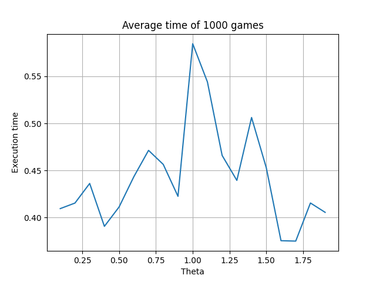

# The Dice Game

This solution provides an AI agent written in Python for playing a dice game, which uses the Value Iteration algorithm to find the optimal policy for the game.

### Game rules:

The player starts with 0 points
Roll three fair six-sided dice

Now choose one of the following:
* Stick, accept the values shown. If two or more dice show the same values, then all of them are flipped upside down: 1 becomes 6, 2 becomes 5, 3 becomes 4, and vice versa. The total is then added to your points and this is your final score.
* OR reroll the dice. You may choose to hold any combination of the dice on the current value shown. Rerolling costs you 1 point – so during the game and perhaps even at the end your score may be negative. You then make this same choice again.

The best possible score for this game is 18 and is achieved by rolling three 1s on the first roll.
The reroll penalty prevents you from rolling forever to get this score. If the value of the current dice is greater 
than the expected value of rerolling them (accounting for the penalty), then you should stick.

## Installation

1. Install Poetry by running `pip install poetry` in your command line.
2. Clone this repository by running `git clone https://github.com/leoneperdigao/dicegame.git` in your command line.
3. Navigate to the root directory of the cloned repository by running `cd dicegame`.
4. Use Poetry to install the dependencies by running `poetry install`. This will create a virtual environment for the project and install all the required packages.
5. Run the game by executing `poetry run python dice_game.py`.
6. Enjoy the game!

## Methodology

The methodology used in this solution is the value iteration algorithm for **Markov Decision Processes (MDPs)**. 
This algorithm is an iterative method to find the optimal policy for a given MDP. 
It starts by initializing the state value array and policy to default values. Then, it iteratively updates the state 
value array and policy until the maximum change in the state value array is less than a given threshold (theta). 
Lastly, the algorithm terminates when the maximum change is less than the threshold.

The technique **Value Iteration** [1] is similar to another algorithm known as **Policy Iteration**, but it has some key differences. 
Policy Iteration starts by initializing the policy with random actions and then evaluates and enhance it until it converges to the optimal policy. 
On the other hand, value iteration evaluates the state-value function and improves it until it converges to the optimal state-value. 
Both algorithms are guaranteed to converge to the optimal solution for any MDP, but value iteration generally requires fewer iterations to converge.
 
The Bellman equation, implemented in the `__calculate_state_value_sum` method, is a fundamental concept in the field of dynamic programming and is used to calculate the value of a state in a Markov Decision Process (MDP), which is the core of the value iteration algorithm. 
The equation can be represented as:

```math
V(s) = max(R(s,a) + γ * Σ(T(s,a,s') * V(s')))
```

Where:

- `V(s)` is the value of the current state `s`.
- `R(s,a)` is the immediate reward for taking action `a` in state `s`.
- `γ` is the discount factor for future rewards.
- `T(s,a,s')` is the transition probability of reaching state `s'` from state s when taking action `a`.
- `V(s')` is the value of the next state `s'`.

This formula is used to calculate the expected state-value for the next state given the current state, action and the transition probabilities. 
The algorithm then updates the state-value array and the policy based on this expected value.

### Code walk-trough

This solution provides an AI agent for playing a dice game, which uses the Value iteration algorithm to find the optimal policy for the game. 
The value iteration algorithm is a method to find the optimal policy for a given Markov Decision Process (MDP). 
The agent `MyAgent` extends the `DiceGameAgent` class, which is an abstraction for a game that can be played using dice.

The `__init__` method of the agent takes in the game that the agent will play, as well as two parameters: `gamma` and `theta`. 
The `gamma` parameter is a discount factor for future rewards, which is used to weigh the importance of future rewards relative to immediate rewards.
The `theta` parameter is a threshold for the convergence of the value iteration algorithm. 

The `__init__` calls the `super` method passing the game as an argument and initialises the parameters gamma and theta which will be used later in the solution.
Lastly, it also calls the `__perform_value_iteration` method, which performs the value iteration algorithm to find the optimal policy for the game. 

The `__initialize_state_value_array_and_policy` method initializes the state-value array and policy dictionary for the value iteration algorithm. 
It creates an empty state-value array and an empty policy dictionary, then sets the value of each key in the array to 0 and the value of each key in the dictionary to an empty tuple.

The `__calculate_state_value_sum` method calculates the expected state-value for the next state, given the current state, action and the transition probabilities. 
It takes in the current state-value array, the current state, the list of next states, whether the game is over, the reward for the current state and action and the transition probabilities for the next states. 
It iterates over the list of next states and the corresponding transition probabilities, and calculates the expected state-value for the next state.

The `__perform_value_iteration` method performs the value iteration algorithm to find the optimal policy for the current game. 
It starts by initializing the state-value array and policy to default values by calling the `__initialize_state_value_array_and_policy` method. 
Then, it iteratively updates the state-value array and policy until the maximum change in the state-value array is less than the given threshold (theta). 
The algorithm terminates when the maximum change is less than the threshold.

The `play` method returns the action stored in the `__policy` dictionary corresponding to the given state.

The key part of the code is the `__perform_value_iteration` method, which is where the value iteration algorithm is implemented and also calls the `__calculate_state_value_sum` method, explained before.
The method also uses the `get_next_state` method, implemented in the parent class, to get the next states, rewards, probability and game over status for the current action and state. 
It uses these values to update the `state-value` array and the `__policy` dictionary.

## Results

For analysing the results of the `MyAgent`, a new Python package was created. 
The package `analysis` holds a module `hyperparameters_search` responsible for simulating **15.000 games**, considering the default
setup for the DiceGame (i.e., without modifications) and also modified version, with 2 dice with 3 sides.

The number of games for the simulation was chosen arbitrarily with the goal of providing enough data for finding optimum values for the hyperparameters `gamma` and `theta`
that would ideally result in high score and low execution times.

The function `run_simulation` is a responsible for randomly sampling theta and gamma values (if not provided) within a specified range for a specified number of iterations.

The function takes the following parameters:

- `game`: the game object to be played 
- `theta`: a fixed value for theta (default=None)
- `gamma`: a fixed value for gamma (default=None)
- `theta_range`: a tuple representing the range of possible values of theta (default=(0.1, 50))
- `gamma_range`: a tuple representing the range of possible values of gamma (default=(0.001, 0.999))
- `num_iterations`: the number of iterations to perform the search (default=1000)

For each iteration, the function generates random `theta` and `gamma` values within the specified range and uses them to play the game with the agent.
The range was random values between `0.01` and `50`. For gamma, random values between `0.001` and `0.999`.
The function records the score and execution time of the game, and keeps track of the best values of theta, gamma, score, and execution time.

All simulations' results are compiled in four graphs:
1. Theta x Gamma, with a yellow-blue colour-range bar representing the execution(s) times.
2. Theta x Gamma, with a yellow-blue colour-range bar representing the scores.
3. Theta x Execution Time, with a yellow-blue colour-range bar representing the scores.
4. Gamma x Execution Time, with a yellow-blue colour-range bar representing the scores.

In all graphs, the average is highlighted in the graph below as a red dot.

### Simulation - Standard Game

For 15.000 simulations with a standard dice game, it was observed an average of:
- `score`: 11.022
- `theta`: 25.13004381510203
- `gamma`: 0.49867969772162335
- `execution time`: 0.00021853686666688184 seconds


### Simulation - Non-standard Game

Likewise, for 15.000 simulations with a non-standard dice game with 2 dice of 3 sides, it was observed an average of:
- `score`: 4.028266666666667
- `theta`: 25.063837356633105
- `gamma`: 0.5028784569875416
- `execution time`: 0.00020274073333457636 seconds


### Analysis

The graphs show that the hyperparameters influence the execution time and the game's score. 
Overall, higher values of `theta` influences positively the algorithm's performance and have little or no impact in the score. Similarly,
high values of `gamma` results in high scores without noticeable impact in the execution time.

Regarding the score trend, this is more easily observed in the second graph in either simulation, where Theta and Gamma are being compared and a color bar is representing the score.
In this graph, is possible to observe that low values of `theta` combined with high values of `gamma` produce the best results in terms of score and execution time.
In other words, `gamma` values close to 1 and theta values close to 0 which are seen in the top-left area of this graph.

### Fine tune hyperparameters

Based on the previous simulations' analysis, the ranges for `theta` and `gamma` were narrowed down. To fine tune the hyperparameters, the ranges were adjusted like so:
- Range for `gamma`: between `0.850` and to `0.999` (steps of 0.001)
- Range for `theta`: between `0.1` and `2` (steps of 0.1)

For tuning each hyperparameter individually, while tuning `gamma`, `theta` was fixed with the mean value from the range above.
The same approach was used for tuning `theta`.

This analysis was performed for both games, a standard and the non-standard dice game with 2 dice of 3 sides.
A total of 1000 games were played using each configuration.

#### Theta fine tune, standard game

|                         Theta vs. Score                         |                    Theta vs. Execution time                    |
|:---------------------------------------------------------------:|:--------------------------------------------------------------:|
|  |  |

#### Theta fine tune, non-standard game

|                           Theta vs. Score                            |                      Theta vs. Execution time                       |
|:--------------------------------------------------------------------:|:-------------------------------------------------------------------:|
|  |  |

#### Gamma fine tune, standard game

|                         Gamma vs. Score                         |                    Gamma vs. Execution time                    |
|:---------------------------------------------------------------:|:--------------------------------------------------------------:|
|  |  |

#### Gamma fine tune, non-standard game

|                           Gamma vs. Score                            |                      Gamma vs. Execution time                       |
|:--------------------------------------------------------------------:|:-------------------------------------------------------------------:|
|  |  |


Based upon the graphs above, it was possible to set the optimum values for `theta` and `gamma` as `1.1` and `0.975`, respectively.

## Discussion

In conclusion, the analysis and experimentation conducted in this report demonstrate the solution effectiveness of the value iteration algorithm to find the optimal policy for a dice game.
The game rules involve rolling three fair six-sided dice and choosing to either stick with the current roll or reroll the dice at a cost of one point. 
Furthermore, the optimal strategy is to reroll the dice only when the expected value of rerolling them is greater than the current roll, accounting for the reroll penalty.

The solution uses value iteration algorithm and applies the Bellman equation to calculate the expected state-value for the next state given the current state, action, and transition probabilities, and updates the state-value array and policy accordingly.

The simulation with significant number of games (15.000) using random `theta` and `gamma` values led the observation of how these parameters affect the algorithm's performance in terms of score and execution time.
Moreover, the set of graphs provided a broad perspective and insights for best selection of hyperparmeters for the agent.

One potential improvement would be incorporating more advanced machine learning techniques such as Q-learning [2] or SARSA [3] for further improve the agent's performance.
In addition, using sparse arrays and matrices to represent the state-value array and policy dictionary instead of nested dictionaries could lead to significant performance gains, especially for large and complex MDPs.

Therefore, the solution provides a solid foundation for understanding and implementing the value iteration algorithm for solving MDPs, and offers opportunities for further development and optimization.

## References

[1] Russel, S., Norvig, P., 2020. *Artificial Intelligence: A Modern Approach*. 4th ed. pp.552-570.

[2] Q-learning [Online]. Available from: https://en.wikipedia.org/wiki/Q-learning [Accessed 29 January 2023].

[3] State–action–reward–state–action [Online]. Available from: https://en.wikipedia.org/wiki/State–action–reward–state–action [Accessed 29 January 2023].
